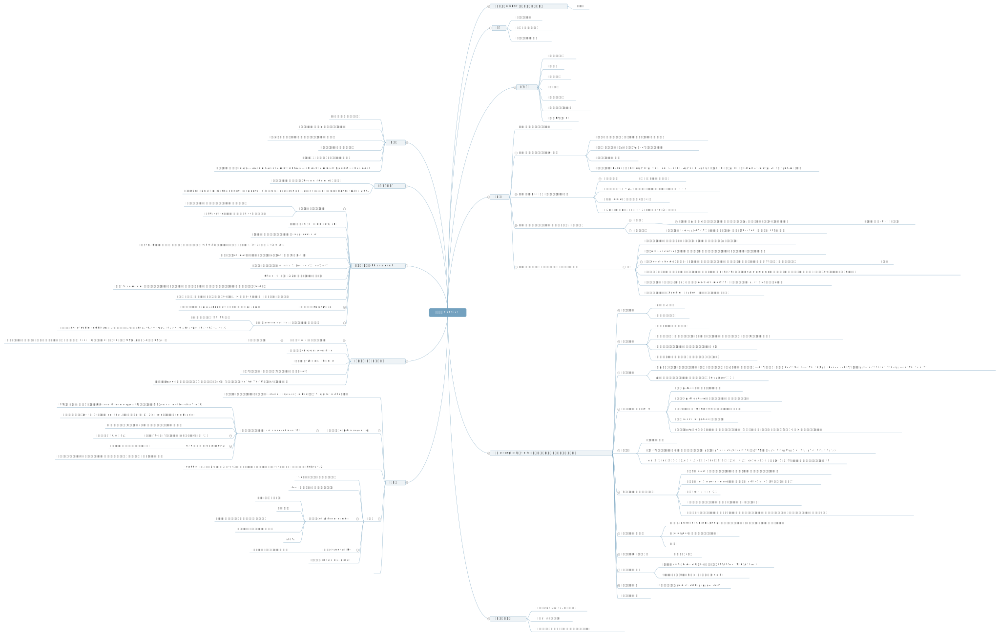
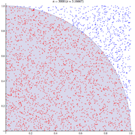

# README
    knowledge set 日常笔记博客

# 框架
    以简单的方式通过django建站，django功能视图
    support restful api service with django3   //daily_log/work_flow/
    tornado功能视图
    gin功能视图

# 一些算法
    简单密码解码和排序工具
    爬虫工具
    数字识别
    猫狗分类
    人流密度估计之空卷积
    电影评论情感分析(未完成)

    
# 统计学相关review
    正态分布和标准正态的转换
    不同坐标的转换方法
    问题分析常用模型  威布尔分布
    城市人口密度分布模型 pareto 分布
    不同或相同分布之间的运算方法
    检验假设的方法
    
    概览
      
   
# 实践    

    假设的估计和多参数的相关性分析方法，比如蒙特卡罗随机场估计圆周率
   
   
    100次随机模拟结果
   
   
# code
<<<<<<< HEAD
     https://github.com/SuboFrank/statistics
=======
     https://github.com/SuboFrank/coding_example
>>>>>>> ae7de116d1d86ea34c2be8ac63206b632ea61162
