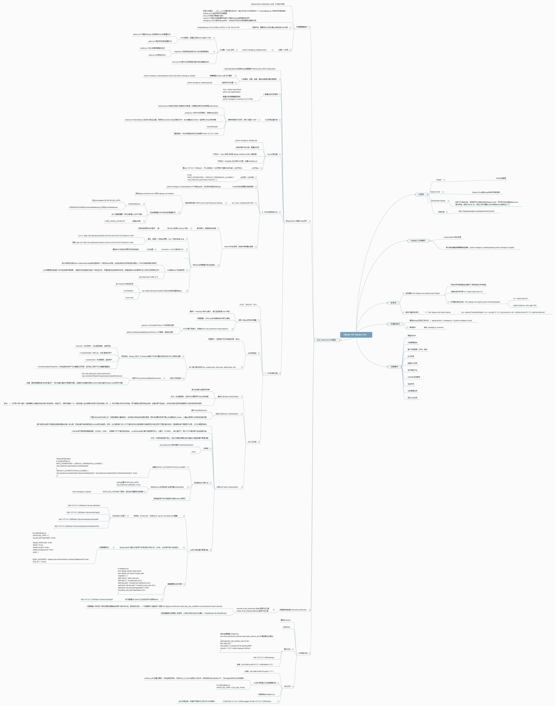
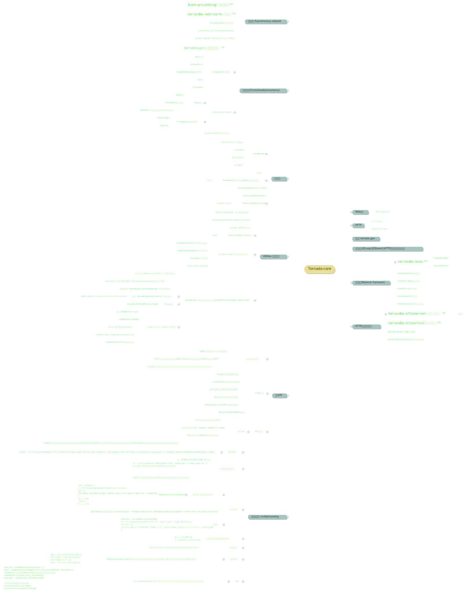

# something about python3
##1 dj中将app 构建为整体web应用  
##2 创建api服务，及与普通web应用的区别
##3 如何整合 后端 API 与 React 前端
##4 高级接口(api)功能
##5 接口的查看和编辑权限 Permissions
### 接口权限限制，多个层次的四种权限限制
### 自定义权限
##6 用户认证
### 基础认证 Base Authentication
### 会话认证 Session Authentication
### 令牌认证 Token Authentication 
##7 接口(api)认证
### rest_framework.authtoken
### dj-rest-auth
##8 接口(api)视图集与路由集
### 视图集 rest_framework.viewsets
### 路由集 SimpleRouter  与 DefaultRouter
##9 接口模板与文档的自动化处理
### 参数处理uritemplate与 PyYAML 
### 模板Schemas，静态与动态drf-yasg

# django3.1+

   
# tornado6.0+
  
   
