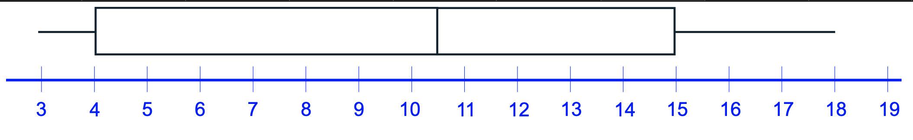
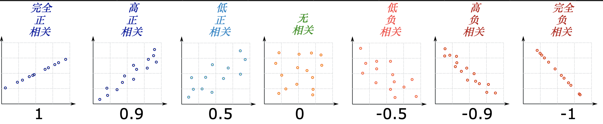
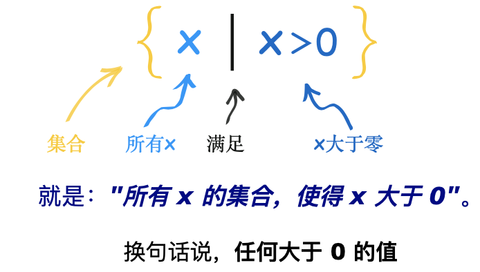
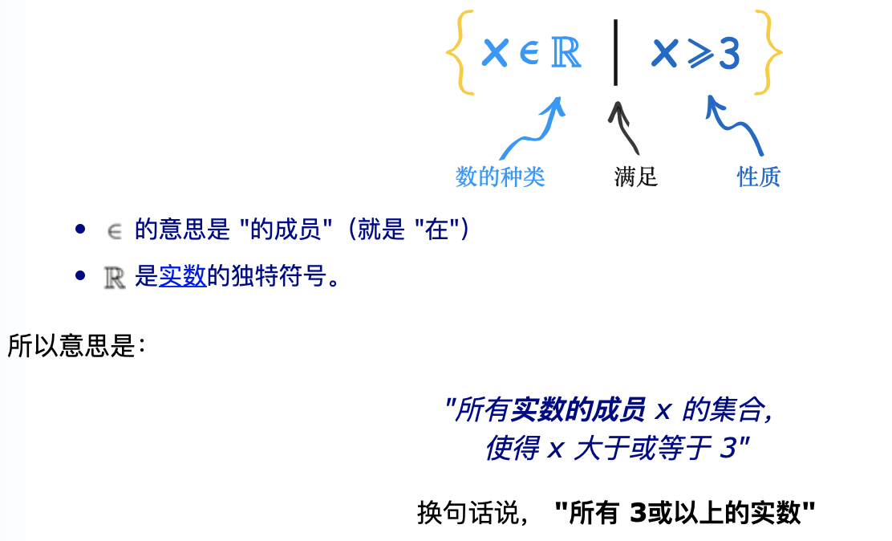

## 散布的评估测度
#### 四分位数
    四分位数是把数列分成四等份的数值：

    把所有数值从小到大排列
    把数列分割成四等份
    在"分割点"位置的数值就是四分位数
    
    * 1, 例子：9、7、4、4、6、2、8
    从小到大排列：2、4、4、6、7、8、9
    分割为四等份: 2、 (4)  4、 (6)  7、 (8)  9
    第一四分位数（Q1） = 4
    第二四分位数（Q2），也是中位数， = 6
    第三四分位数（Q3） = 8
    
    * 2, 例二，
        1、3、3、4、5、6、6、7、8、8
        四分位数 2 是在第 5 和第 6个数的正中间：

        Q2 = (5+6)/2 = 5.5
        第一四分位数（Q1） = 3
        第二四分位数（Q2） = 5.5
        第三四分位数（Q3） = 7
        
    "四分位距" 是从 Q1 到 Q3：
    例一的 四分位距是:
        Q3 − Q1 = 8 − 4 = 4
        
     
    * 箱型图
    * 3， 例三：
    箱须图和四分位距
    数据是 4、17、7、14、 18、12、3、16、10、4、4、11

    从小到大排列：

    3、4、4、4、7、10、11、12、14、16、17、18

    分割成四等份

    3、4、4 | 4、7、10 | 11、12、14 | 16、17、18
    
    所有的四分位数都在数与数的中间：

    第一四分位数（Q1） = (4+4)/2 = 4
    第二四分位数（Q2） = (10+11)/2 = 10.5
    第三四分位数（Q3） = (14+16)/2 = 15
    
    最小值是 3，
    最大值是 18
    四分位距:
        Q3 − Q1 = 15 − 4 = 11
    
    图形如下:
  
  
  
#### 离群值
    "离群值" 是数据里与其他数值分开的数值（"离"开其他的"群"值。
    
#### 平均差
    平均差告诉我们，每个数据值平均离中心有多远
    平均差 =  	（Σ|x - μ|）/N	  =  	636/5	  = 127.2
    
    平均值一边的偏差应该和另一边的偏差是相等的

#### 绝对偏差
    每个距离是叫绝对偏差，因为它是偏差的绝对值（离平均值的距离）

#### 单变量和双变量数据
    单变量数据：

    求中心值：用 平均值、中位数 和 众数
    求数据的分散程度：用 范围、四分位数 和 标准差
    画图：例如 柱形图、饼形图 和 直方图
    
    
    双变量数据:
        双变量数据，我们有兴趣的是比较两组数据并寻找其中的关系。

        我们可以用列表、散布图、相关性、最优拟合线和常理来帮助我们分析
     
#### 相关
    当两组数据有强烈的相互关系时，我们说它们高度相关。
    相关不等于因果关系" …… 就是说，相关不代表一个现象导致另一个（相关可能有其他的原因）
    
    若两组的值一起增大，我们称之为正相关，
    若一组的值增大时，另一组的值减小，我们称之为负相关
    我们在这里讲的是线性相关（跟随直线的相关）。
    
    相关可以用值来表达：
    
    1 是完全正相关
    0 是无相关（没有相互关系）
    -1 是完全负相关
    这个值显示相关有多强（并不代表线有多陡）以及相关是正相关还是负相关。
    
   
    
    计算过程:(可用皮尔森相关系数 CORREL() 函数， 或者 "斯皮尔曼等级相关系数"）
        设 "x" 和 "y" 为两组数据（在我们的例子，温度是 x，冰淇淋销量是 y）：

        一、分别求 x 和 y 的平均值
        二、从每个 x值减去 x 的平均值（以 "a" 来代表结果），y 也做同样的计算（以 "b" 来代表结果）
        三、求：每一个值的 a × b、a2 和 b2
        四、把 a × b 加起来、 a2 加起来、b2 加起来
        五、用 a × b 的总和除以 [(a2 的总和) × (b2 的总和)] 的平方根
    
#### 加权平均
    加权平均值：某些数值占较高比重的平均值。

    当权数的和等于 1 时，用每个权数乘以其对应的数值，然后把结果加起来

    否则，用每个权数 w 乘以其对应的数值 x，把结果加起来，然后除以权数的和：
    
    加权平均值 =  	Σwx/Σw
    
    最近的工作时间：

    2个星期：每星期 1天
    14个星期：每星期 2天
    8个星期：每星期 5天
    32个星期：每星期 7天
    小李平均每星期工作多少天？
    
    权数  日数
    w	   x    wx
    2	   1	2
    14	   2	28
    8	   5	40
     32	   7	224
    Σw = 56	 	Σwx = 294
    
    Σwx / Σw = 294 / 56 =  5.25 
 

#### 范围
    范围是最小值与最大值的差。
    
#### 函数的值域
    值域是函数所有的值
   
#### 定义域、值域和陪域
    函数允许的输入和可能的输出都有特定的名词：

    	允许输入到一个函数的集合称为定义域
        函数的可能输出叫培域
    	函数的实际输出叫值域
    例如 f(x) = 2x + 1，那么对应的
    定义域：{1, 2, 3, 4}
    陪域：{1, 2, 3, 4, 5, 6, 7, 8, 9, 10}
    值域：{3, 5, 7, 9}
    
    
    陪域的意义:
        函数 "f" 的定义域是 "N"（自然数），而陪域也是 "N"。
        平方根 是不是函数？

        如果我们把陪域（可能输出值）定义为实数，平方根就不是函数！…… 奇怪吗？

        原因是一个输入值可以有两个输出值，例如 f(9) = 3 或 -3

        函数 一定要是单值的。一个输入值不能有多于一个输出值。所以 "f(9) = 3 或 −3" 就不行了！

        但是若我们把陪域定义为非负实数，平方根就是函数了。

        √实际上，平方根符号（√x）的意思一定是主（正）平方根，所以√x 是个函数，因为陪域的定义是正确的。

        因此，陪域的定义可以决定一个关系是否函数。`
        Dom(f) 或 Dom f 的意思是："函数 f 的定义域"

        Ran(f) or Ran f 的意思是： "函数 f 的值域"
        
        
#### 集合构建式符号:    
    自然数-N	 整数-Z	有理数-Q	实数-R	虚数-I	复数-C
    
    任何大于 0 的值
   
   
    任何大于 3 的实数
   
    
       