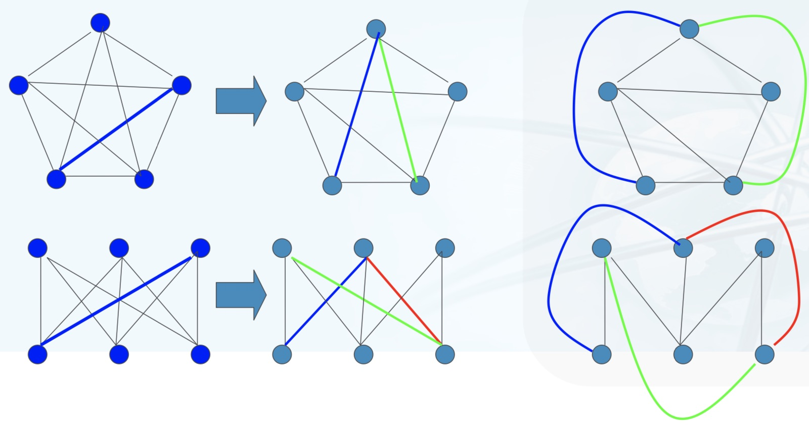

## 离散数学知识点
# 无限
    一个线段和一个面积 如果用无限个点来描述，线段点可以一一映射到面积的点

# 集合概念
    康托尔的集合论(朴素集合论) (Cantor，Georg Ferdinand Ludwig Philipp 1845-1918)
    [0,5] 和 [0,12] 两个实数集之间可以通过一一对应关系建立联系
    y = (12/5)x
    甚至 一个线段的所有点 与 n维空间的所有点可以一一对应。
    
    无限集合
        可数集
            和自然数一一对应关系的可数集
        具有连续统的势的集合
            和实数区间[0,1]构成 一一对应的具有连续统的势的集
            
    又引入论 基数，序数，超限序数，超限基数等概念，并规定论他们的运算
    基数(势) 的引入 描述论集合中元素数量的一种刻画
        规定论不同层次无限集合的基数。
    集合论需要 严格运用纯理性论证，结论不是人的直观和常识所能掌握的
    
     希尔伯特公理化思想进行公理化 避免产生 罗素悖论   
## 重言式
    命题公式的分类，根据真值角度分类
    1，重言式，永真式 tautology
        命题变元的所有赋值都是命题公式的成真赋值
        
    2，矛盾式，永假式，不可满足式  contradiction
        命题变元所有赋值都是命题公式的成假赋值
    3，可满足式 contingency    
        命题公式至少有一个成真赋值
    1 都是 3 即 永真式都是可满足式
    2 都不是 3，即永假式(矛盾式)都不是可满足式 
    非1 不一定都是 2，即 非永真式，并不都是永假式
    但是 如果 具体到A是永真式，非A是永假式
    
    命题公式到 真值表，证明重言式
    
    证明 (p v q)⋀¬p -> q 是永真式, 使用真值表
    p   q   pvq     ¬p      (pvq)⋀¬p     (p v q)⋀¬p -> q 
    0   0    0      1           0               1
    0   1    1      1           1               1
    1   0    1      0           0               1
    1   1    1      0           0               1
    
    0 蕴含 0 是 1
    0 蕴含 1 是 1
    最后一列全部是 1，所以命题是 永真式
    例:
        对于任何公式A
        A∨¬A是重言式(排中律)
        A∧¬A是矛盾式(矛盾律)
        采用命题公式的真值表证明重言式
        
### 数理逻辑
    代入原理 rule of substitution
        将重言式A中的某个命题变元p的所 有出现都代换为命题公式B，得到的命题公式记作A(B/p)，A(B/p) 也是重言式
        因为重言式A的真值与p的取值状况 无关，恒为t，所以将p全部代换后的公式A(B/p)的 真值也恒为t
        * 仅代换部分出现本原理不成立
    替换原理 rule of replacement
        将命题公式A中的子公式C的部分出现替换为和C逻辑等价的公式D (C╞╡D )，得到的命题公式记作B，则A╞╡B。
        因为C和D(在任何赋值下)等值，所以用D替换C不会改变A的真值
        * 不要求全部出现都替换
    代入原理和替换原理的区别
                        代入原理RS             替换原理RR
        使用对象        任意永真式               任意命题公式
        代换对象        任意命题变元              任意子公式
        代换物          任意命题公式             任意与代换对象等价的命题公式
        代换方式        代换命题变元的所有出现     代换子公式的某些出现
        代换结果        仍为永真式               与原公式等价
    
        
    逻辑等价式与逻辑蕴含式
        当命题公式 A <-> B 是重言式时，则称A逻辑等价与B，记为 A⧦B，称逻辑等价式
        也可以说公式A和B等值
        逻辑等价表示，在任何赋值情况下A，B都等值
        证明方法:
            真值表法
            赋值进行讨论
            推演法
            
    * 重要性质
        命题公式关系的自反、对称、传递等性质
        A╞╡B当且仅当╞A↔B
        A╞B当且仅当╞A→B
        若A╞╡B，则B╞╡A
        若A╞╡B， B╞╡C，则A╞╡C
        若A╞B，则¬B╞¬A
        若A╞B， B╞C，则A╞C
        若A╞B，A╞╡A’，B╞╡B’，则A’╞B’
        
        
    一些重要的逻辑等价式 A，B，C是任意公式
     1,   ¬¬A╞╡A(双重否定律)
     2,   A∨A╞╡A，A∧A╞╡A(幂等律)
     3,   A∨B╞╡B∨A， A∧B╞╡B∧A(交换律)
     4,   (A∨B)∨C╞╡A∨(B∨C)，(A∧B)∧C╞╡A∧(B∧C)(结合律)
     5,   A∧(B∨C)╞╡(A∧B)∨(A∧C)，A∨(B∧C)╞╡(A∨B)∧(A∨C)(分配律)
     6,   ¬(A∨B)╞╡¬A∧¬B， ¬(A∧B)╞╡¬A∨¬B(德摩根律)
     7,   A∨(A∧B)╞╡A， A∧(A∨B)╞╡A(吸收律)
     8,   A→B╞╡¬A∨B(蕴涵等值式)
     9,   A↔B╞╡(A→B)∧(B→A)(等价等值式)
     10,  A∨t╞╡t，A∧f╞╡f(零律)
     11,  A∨f╞╡A，A∧t╞╡A(同一律)
     12,  A∨¬A╞╡t， A∧¬A╞╡f(排中律和矛盾律)
     13,  ¬t╞╡f，¬f╞╡t
     14,  A∧B→C╞╡A→(B→C)
     15,  A→B╞╡¬B→¬A(假言易位)
     16,  (A→B)∧(A→¬B)╞╡¬A(归谬论)
     17,  A↔B╞╡(A∧B)∨(¬A∧¬B)(等价等值式2)
    
    一些重要的逻辑蕴含式,A,B,C是任意公式
        1, A╞A∨B
        2, A∧B╞A
        3, A∧(A→B)╞B
        4, (A→B)∧¬B╞¬A
        5, ¬A∧(A∨B)╞B
        6, (A→B)∧(B→C)╞A→C
        7, (A→B)∧(C→D)╞(A∧C)→(B∧D)
        8, (A↔B)∧(B↔C)╞A↔C
    
       
## 范式
    在命题公式的多个逻辑等价形式中，较为符合 '标准 ' 或 '规范的' 一种形式
    利用逻辑等价式和代入原理、替换原理，可 以求出任一一个公式的析取范式和合取范式。
    范式组成部分:
        文字 literals     命题变元，常元和他们的否定。 常元称正文字，否定称负文字
        析取子句 disjunctive clauses   文字或若干文字的析取  如 p，pvq, ¬pvq
        合取子句 conjunctive clauses    文字或若干文字的合取  如p, p⋀q, ¬p⋀q
        互补文字对 complemental pairs of iterals   指一对正文字和负文字   如 p 和 ¬p
    
    符号含义:
    逻辑等价        ⧦, <->
    析取，或(多选1)  ⋁
    合取，并且      ⋀ 
    蕴含           -> 或 ↦
    not,并非       ¬    
    运算顺序        ()
    推导出         ⊢
    双条件（同等价于）<-> 即(P∧Q)∨(┐P∧┐Q)）
        A←B，A是B的必要非充分条件，A→B，A是B的充分非必要条件
        （1）由A可以推出B，由B可以推出A，则A是B的充分必要条件()，或者说B的充分必要条件是A。
        （2）由A可以推出B，由B不可以推出A，则A是B的充分不必要条件(A∈B)
        （3）由A不可以推出B，由B可以推出A，则A是B的必要不充分条件(B∈A)
        （4）由A不可以推出B，由B不可以推出A，则A是B的既不充分也不必要条件
        
    * 析取范式
    A` ⧦ A   A`等价于 A， A’为合取子句或者若干合取子句的析取
    p -> q , p 蕴含q的析取范式为
         ¬p ⋁ q  # 析取子句 ¬p和q的析取
    
    ((p -> q) ⋀  ¬p)⋁ ¬q  的析取范式
        ¬ p v (q ⋀ ¬ p)⋁ ¬q   
    析取范式的重言式识别
        合取范式中每个析取子句都包含了至 少一个互补文字对:(p∨¬p∨q)∧(p∨q∨¬q)
    矛盾式识别
        析取范式中每个合取子句都包含了至 少一个互补文字对:(p∧¬p∧q)∨(p∧q∧¬q)      
    
    * 合取范式
    公式 A1 称作公式A的合取范式，如果 A` ⧦ A  A’为析取子句或者若干析取子句的合取
    A` 为析取子句或若干析取子句的合取
    p -> q 的合取范式为 ¬p ⋁ q  # 蕴含等值式
    
    * 主范式
        ** 主析取范式 (majordisjunctiveform)，任何一个命题的主析取范式都是存在的，并且唯一。
        公式A'称作公式A(p1,p2,...pn)的主析取范式，如果: A'是A的析取范式，A'中每一个合取子句里p1,p2,...pn均恰出现一次
        存在且唯一性证明: 约定,极小项赋值引理,主析取范式的成真赋值,存在性证明，命题公式A(p1, p2, ...pn)的等值分 类
        1，合取子句中的文字按照其包含的变元下标从小到大排列，
            对于包含所有变元p1, p2, ...pn的并排列好文字顺序的合取子句，我们称为极小项(min term)，记作mi
            其中i是一个整数，i对应的n位二进制表示描述了对应下标的变元在合取子句中的否定状态
            如果该位是0，表示合取子句中的该位是一个负文字，否则是正文字
            例如：p1∧p2∧p3记作m7(7=111);p1∧¬p2∧¬p3记作m4(4=100)
          
        2，主析取范式是极小项按照其下标从小到大排列的析取
             p1∧p2∧p3(m7)的唯一成真赋值 是p1=1, p2=1, p3 =1
             p1∧¬p2∧¬p3(m4)的唯一成真 赋值是p1=1, p2=0, p3 =0
        主析取范式构造步骤:
            1,假设A'是公式A(p1, p2, ...pn)的析取范式
            2,如果A'中某个合取子句Ai既不包含pj，也不包含¬pj，那么我们将Ai展成如下 形式:
            3,Ai╞╡Ai∧1╞╡Ai∧(pj∨¬pj)╞╡(Ai∧pj) ∨(Ai∧¬
            4,将合取子句中重复出现的命题变元，矛盾式消去，将重复出现的合取子句消去
            5,p∧p╞╡p; p∧¬p╞╡0; Ai∨Ai╞╡ Ai
            6, 最后将所有的合取子句整理变元顺序，成为极小项，并得到主析取范式A'' 
         
        ** 主合取范式(majorconjunctiveform)  与主析取范式 具有对称性质
        公式A'称作公式A(p1,p2,...pn)的主合取范式，如果: A'是A的合取范式，A'中每一个析取子句里p1,p2,...pn均恰出现一次
        证明:
        极大项和成假赋值，命题公式A(p1, p2, ...pn)的等值分 类
    
    
        
    联结词功能完备集
    如果你能选择一个由连接词“非，析取，合取”构成的命题公式A，
    能证明由原子变元P，Q通过该集合X中的连接词不能构造出与命题公式A等值的公式，则该连接词集合就不是完全集
    {┐，∧，∨，→}可以表示任一真值函数，因而{┐，∧，∨，→}是全功能的。
    {┐，↔}非全功能集合，无法表示P∧Q
    
    求析取范式的步骤:
        1，消去公式的联结词 -> 和 <->   如 p->q 转化为 ¬p ⋁ q 
        2，
       
##  形式系统
    重言式反映了人类基本思维逻辑
    排中律   它是任意的公式   A V ¬A ⧦ t   与真 t等价  t表示 true
    矛盾律   A与非A的 析取 A ⋀ ¬A ⧦ f    等价于 假   f表示false
    假言推理  A ⋀ (A -> B) ⊨ B      左式两个条件成立，必然有B 成立
    归谬推理  (A -> B)⋀ ¬B ⊨ ¬A     A蕴含B，同时 B不成立，那么 A也不成立
    穷举推理  (A V B)⋀(A->C) ⋀(B->C) ⊨ C   A合取B 然后 析取 与A蕴含C，再析取B蕴含C，那么C一定成立
    不妨设
    
    形式系统是一个 符号体系
    推理过程也是符号的变化过程
    公理
        以若干最基本重言式作为基础
    推理规则  rules of inference
        系统内符号变换 的依据是若干确保由 重言式 导出重言式的规则，称为推理规则
    *(公理) 和 *(推理规则)确保系统内由正确的前提总能得到 正确的推理结果
    
    真值计算，  
    代入原理，
    替换原理  
    
    证明 proof 和演绎 Deduction 
    
    演绎
        A1,A2,...,Am 称为 Am的 以 r 为前提的演绎
    证明是演绎 在 r 为空集的特例
     
    
    * 命题演算形式系统 PC(Proposition Calculus)
        PC定理 就是 一个命题公式
        命题以及重言式变换演算构造的形式系统
        符号系统
            命题变元
                p,q,r,s,p1,q1,...
            命题常元
                t,f 
            联结词
                ¬, -> （注意是联结词功能完备集，否定和蕴含 即{¬, ->}是最小功能完备集）
            括号
                (,)
            命题公式
                ( 高级成分，规定了字符的合法组合方式
                1,命题变元和命题常元是公式;
                2,如果A,B是公式，则 ¬A，A -> B是公式;(结合优先级和括号省略约定同前)
                3,只有有限次使用上面两条规则得到的符号串才是命题公式
    PC一致性
    PC合理性    
    
    * 三个元定理
        meta theorem
        关于定理证明的 定理，就是定理的定理
        
        演绎定理
            ⊢ 推出
            任意公式集合 r 和 公式 A，B
            r ⊢ A->B 当且仅当 r U {A} ⊢ B
            当r = 空集时， ⊢A -> B 当且仅当 {A} ⊢B 或 A⊢B
            证明必要性
            有A -> B，加上A，分离规则得到B
            证明充分性
            分离规则
        
        归谬定理(反证法)
        穷举定理
        
    * PC系统的定理判定问题
        1，命题演算系统PC有一个非常重要的同构：真值函数运算系统
        2，用 真值表判定命题公式对应的真值函数是否重言式，即可判定是否 PC中的定理
        3，真值表的运算是 有限步骤 可以完成的 (真值表并不是PC中的成分)
    MIU 同构系统，定理树
    
## 逻辑--命题逻辑和谓词逻辑
    命题是对确定问题对判定 陈述句
    命题逻辑中最小研究单位是 原子命题，并没有进一步对内部结构
    
    命题逻辑对推理，关注真值对推演
    三段论
        大前提 p: 所有学校都有学生
        小前提 q: 北京大学是学校
        结论 r: 北京大学有学生
    
    谓词(predicate)逻辑，一阶逻辑  First Order Logic
        将量词作用于 个体，引入个体变元，讨论不确定对象
    谓词:作出判断的词，表示谓词 P,Q,R
        占位符 plcae holder
        谓词中可以放置个体的空位个数称为谓词的元数
        单元谓词 (r)，如: 是, 小李是工程师
        二元谓词 (x,y)，如: ...和...是朋友， 
        三元谓词 (x,y,r)，如:...和...是...， 小李和小明是朋友
        谓词填式
    个体: 被作出的判断，一切被讨论的对象都称为个体
        确定的个体表示方法: a,b,c，称为个体常元 constants
        不确定的个体: x,y,z,u,v,w 称为个体变元 variables
        被讨论的对象的全体称作个体域 domain of individuals，记为D
        包含一切对象的个体域称为 全体 U(universe)
    量词
        全称量词 "所有" universal quantifier  记为 ∀(Any/All)
        存在量词 "有" existential quantifier  记为  ∃(exist)
        量词作用于谓词时，需要引入一个指导变元，同时放在量词后面和谓词填式中
         ∀xP(x), ∃xP(x)    #x 为指导变元，可以是y，z都行
         
        指导变元是 "不可取值代入" 的，称作 约束变元 bound variables
        约束变元可以改名而不改变语句含义
        谓词或复合谓词表达式，称作量词
            辖域 domain of quantifiers    
        被约束后的 一元谓词     
            ∀xP(x) 是命题
                其等价命题是  P(a1) ⋀ ... ⋀P(aN)
            ∃xP(x) 命题的等价命题是
                P(a1) v ... v P(aN)   
        ∃xP(x，张三)  # 表示世界上有张三的朋友
        个体域 {1,2} 
        哥德巴赫猜想的表示
            个体域是所有正整数
            陈述: 所有大于2的偶数，均可表示为两个素数之和
            表示: ∀x∃p∃p(Even(x)⋀(x>2) ->(x=p+q)⋀Prime(p)⋀Prime(q))
              
    二阶逻辑
        将量词作用于谓词，引入谓词变元
        她的职业是工程师        # 一阶
        她的第一职业是工程师     # 二阶
    
    * 数理逻辑        
    * 谓词公式
        谓词填式是公式，命题常元 零元谓词 是公式，称作原子公式
        如果A，B是公式，x为任一变元，那么(¬A), (A->B),(∀xA),(∃xA), 都是公式(5个联结词还包含 析取，合取,等价)    
        只有有限次使用上述两个条件形成的符号串就是 公式
        
        称为命题的条件
            如果给定"个体域"，公式中所有谓词都有"明确意义"，公式中所有自由变元 取定个体，谓词公式就称为一个 命题
            
        自然语言形式化
        有人勇敢，但不是所有人都勇敢
        ∃xBrave(x) ⋀ ¬∀xBrave(x)   
    谓词公式永真式
        元素:
        个体域 D
            谓词符号解释I
                个体变元 x
        
    谓词演算形式系统 FC
        
    * 全称引入规则及存在消除规则
        为了简洁用很少的联结词和推理规则
    * 自然推理系统 ND natural deduction
        更多的 推理规则和联结词
        5个联结词，2个量词
        少数公理，更多规则，引入假设
        用推理规则体现人的推理习惯
        nd 符号系统
        推理规则 - 我tm居然听完了
            1，假设引入规则
            𝝘⊢B
            𝝘;A⊢B(源于重言式 B->(A->B))
            假设消除规则
            𝝘;A⊢B，𝝘;¬A⊢B
            𝝘⊢B(源于重言式 ¬A->(A->B))
            
            2，析取联结词的引入规则
            𝝘⊢A
            𝝘⊢AvB(源于重言式A->(AvB))
            引入加强形式
            𝝘;¬B⊢A
            𝝘⊢AvB(源于重言式(¬B->A)<->(BvA))
            消除规则
            𝝘;A⊢C，𝝘;B⊢C，𝝘⊢AvB
            𝝘⊢C(源于重言式(AvB)⋀(A->C)⋀(B->C)->C)
            
            3,合取的引入规则
            𝝘⊢A，𝝘⊢B
            𝝘⊢A⋀B
            消除规则
            𝝘⊢A⋀B
            𝝘⊢A 或 𝝘⊢B
            
            4，蕴含的引入规则
            𝝘；A⊢B
            𝝘⊢ A->B(演绎定理)
            
            消除规则
            𝝘⊢A->B, 𝝘⊢A
            𝝘⊢B(PC 和 FC中的分离规则)
            
            5， 否定引入规则
            𝝘；A ⊢ B，𝝘；A ⊢ ¬B
            𝝘 ⊢ A
            
            引入规则2
            𝝘；A ⊢ f
            𝝘 ⊢ ¬A(反证法)
            
            消除规则
            𝝘⊢A， 𝝘⊢ ¬A
            𝝘⊢B （虚假的前提可以蕴含任何结论），永假可以蕴含任何结论
            
            6，双重否定¬¬ 引入
            𝝘⊢A
            𝝘⊢ ¬¬A
            ¬¬ 消除规则
            𝝘⊢ ¬¬A
            𝝘⊢A
            
            7，<->引入规则
            𝝘⊢ A->B， 𝝘⊢ B->A
            𝝘⊢A <->B
            消除规则
            𝝘⊢A <->B
            𝝘⊢ A->B 或 𝝘⊢ B->A
            
            8，量词引入和消除
            𝝘⊢ ∀A
            𝝘⊢ ∀vA（v在A中无自由出现，FC公理）
            消除
            𝝘⊢ ∀vA(v)
            𝝘⊢ A(t/v) (t对v可代入)
            源于FC的公理A4：∀xA(x) - >A(t/x)
            
            9,存在的引入和消除 ∃
            𝝘⊢ A(t)
            𝝘⊢ ∃vA(v/t)  (源于永真式 A(t) -> ∃vA(v/t))
            消除规则
            𝝘⊢ ∃vA(v)， 𝝘； A(e/v)⊢C
            𝝘⊢C
            
    * ND中定理证明
        公理
        𝞒； A⊢A  GAMA （𝝘是公式集合）
        
        A为 𝝘 的演绎结果，即 𝝘⊢ndA 简记为 𝝘⊢，如果存在如下序列
        (𝝘=𝝘1) 𝝘1⊢A1, 𝝘2⊢A2,...,𝝘n⊢An(𝝘n=𝝘,An=A)
        
        使得 𝝘i⊢Ai(i<=i<=n)
        1, 是公理
        2, 𝝘j⊢Aj(j<i)
        3, 𝝘j1⊢Aj1, ..., 𝝘jk⊢Ajk 
        
        定理 ⊢A v ¬A 证明过程如下
        1, A ⊢ A 公理
        2, A ⊢ A v ¬A (v引入规则1)
        3, ¬A ⊢ ¬A  公理
        4, ¬A ⊢ A v ¬A   v 引入规则3
        5, ⊢ A v  ¬A  假设消除规则2，4
         
    * ND性质
        FC PC的公理是 ND中的定理
        ND 是合理，一致 和完备的

# 集合论
    集合论围绕无限概念展开的
    康托尔 G.Cantor 
        Zeno 芝诺二分法悖论
        追乌龟
        飞箭的瞬时不动，运动过程就不动了？
    集合的连续性，时间空间的连续性问题
    
    欧几里得 整体大于部分规则，欧几里得几何空间
    进程和整体
    
    亚里士多德提交区分两种无限
    潜无限
        作为过程的无限，永远延伸，完成不了的进程，如自然数1，2，3,...,n,...
    实无限
        一个已完成整体的无限，所有自然整数，(1,2,...,n,...)
        
    无限事物，无法构成一个整体
    
    普罗柯拉斯 Proclus 410-485 的无限分圆问题
    伽利略 G.Galileo 1564-1642  发现不等长线段的点可以构成一一对应关系
    
    实数集[0,5] 和 [0,12]的一一对应关系 y= (12/5)x
    
    可数集
        自然数构成的一一对应关系的可数集
    具有连续统的势的集合
        与实数集区间[0,1]一一对应的具有连续统的势的集
    一条直线的点 和 平面 和整个n维的点具有一一对应关系
    又引入基数(势)，序数，超限基数，超限序数等概念
    集合论需要 严格运用纯理性论证，结论不是人的直观和常识所能掌握的
    
    希尔伯特公理化思想进行公理化 避免产生 罗素悖论  
    
    * 集合记号 {}
        A = {1,2,3}
        S = {1,{2,3},10}
        N = {}
    元素和集合的隶属关系
        对象a是集合A的成员时，称a属于A， a∈A
    规定集合的方式
        
        列举法
            A = {1,2,3}
            B = {a1,a2,...,an}
        描述法
            A = {x|P(x)} 或 A={x:P(x)}
            表示x∈A 当且仅当(充要条件)P(x) 
            
            前n个自然数集合的集合
            {Nn|n∈I+}   "n∈I+" 表示 n属于正整数
        归纳法
            
            
        空集
            {}
            𝛷   # CAPITAL PHI
            𝛷 = {} = {x|x != x}  # 用矛盾式定义
        有限集 finite sets
            空集和只包含有限多元素的集合称为有限集
            否则就是无限集
        
        基数 cardinality
            有限集成员个数称作集合的基数
            无限集合 的基数定义更复杂
            
        势
            无限集
            势的概念只用于比较两个无穷集的元素多寡，
            不能直接指称某集合的「元素个数」。要达到这个目的，可以使用基数的概念。
        集合相等
            两个集合A和B 当且仅当 两个集合元素相同
    * 集合三大公理
        外延公理 extensionality axiom
            A=B <-> ∀x(x∈A <-> x∈B)
            {0,1}={1,0}={x|x=0 v x=1}
            
            说明集合元素的无序性，以及集合表示形式的不唯一性
        概括公理
            对于任意个体域U，任一谓词公式P都确定一个以该域中的 对象为元素的集合S
            S={x|x∈U ⋀ P(x)}
            此公理规定了集合的 确定性
            
            空集 当P(X) 永假式，S为空集
        正规公理
            不存在集合A1，A2，A3,...使得 ...∈A3∈A2∈A1
            直观来说就是集合的有限可分，个体域的元素是基本粒子
            
            正规公理确立了元素和集合的不同层次性，集合不能是自己的成员
            排除了A={A}这样的 '病态' 集合
    集合基本关系
        隶属，子集描述
        包含，集合中元素的描述
    * 子集合
        集合A的所有元素都是B中的元素，那么A是B的子集
        记为: A⊆B  # A是B的子集
        ∀x(x∈A <-> x∈B)
        {a,b}⊆{a,b,c}
        a ⊆ {a,b,c}  # 错误的，只能表示为 a ∈ {a,b,c}
        {a,b}⊆{{a,b},{c,d}}  # false
        {a,b} ∈ {{a,b},{c,d}} # true
    有时候隶属和包含可以同时成立
        如 {1} 和 {1,{1}} 的关系
## 集合定理
    1， 相等：对于任意集合A和B，A=B当且仅当A⊆B 且 B⊆A
        任何集合都是 自身的 子集
    2，子集传递: A，B，C为任意集合，若 (A⊆B)⋀(B⊆C) 则有A⊆C
        证明：逻辑蕴含式 I6，(A->B)⋀(B->C) ⊧ A->C 
    3，对于任意集合A，A⊆U，
    因为 x∈U是恒真的，所以 ∀x(x∈A <-> x∈U)也是恒真的
    4，空集是任意集合的子集
    5，空集是唯一的
    6，设A为有限集合，|A|=n, 那么A的子集个数为 2**n
       C(0,n) + C(1,n) +...+C(n,n) = 2**n
    
    真子集 proper subset
        如果 A⊆B且 A != B,记为A⊂B，A是B的真子集
        空集是所有非空集合的子集
## 集合运算
    集合元素不能重复
    定义: 以集合作为运算对象，结果仍然是集合的运算
    ∪∩⊃ 
    并运算 U union
    A∪B ={x|x∈A v x∈B} # 析取
    {1,2}∪{1,3,4}={1,2,3,4}
    交运算 ∩ intersection
    A∩B = {x|x∈A ⋀ x∈B}      # 合取
    {1,2}∩{2,3}={2}
    
    差运算 - difference
    定义: A-B ={x|x∈A ⋀ x∉B}   # 合取，属于A但是不属于B的元素组成的 集合
    
    补运算 ～ complement
    定义: A~ = U-A ={x|x∉A}   #  A对于U的补集, 是那些在U中的元素，但是 不是A的集合
    {0,1,2,3,4}~ = {5,6,7,...} (U=N)
    
    运算性质
    A ∪ A =A
    A ∩ A =A
    交换律
       A ∪ B =  B ∪ A  #∩ 同理
    结合律
       A ∪(B∪C)= (A∪B)∪C # ∩ 同理
       A ∪∅=A, A∩∅=∅, A∪U=U,A∩U=A
    分配律
       A∪(B∩C)=(A∪B)∩(A∪C), A∩(B∪C)=(A∩B)∪(A∩C)
       A∪(A∩B)=A, A∩(A∪B)=A
    差和补的运算性质,证明:德摩根律
       A-(B∪C)=(A-B)∩(A-C)
       A-(B∩C)=(A-B)u(A-C)
       A-(B∩C∩D)=(A-B)u(A-C)u(A-D)
    A~ ~ =A, U~ = ∅, ∅~ = U, A u A~ = U, A n A~ =∅
    (A u B)~ = A~ n B~, (AnB)=A~ u B~
    A-B =   A n B~
    
    对于任意集合A,B，如果有A u B= U且 AnB=∅，那么A=B~
    证:A=AnU = An(BuB~)=(AnB)u(AnB~)=∅u(AnB~)=(BnB~)u(AnB~)  # 根据分配律提出B~
     =(BuA)nB~  # 因为AuB=U,
     = UnB~ = B~ # 得证 A=B~
     
    * 幂集(power set)运算
        对任意集合A，𝛒(A)称作A的幂集，定义为：𝛒(A)={x|x⊆A}  # 𝛒 读作 rho
    A的所有子集作为元素构成的集合(族)  
    因为∅⊆A, A⊆A;所以必有∅∈𝛒(A), A∈𝛒(A)
    𝛒({1,2})={∅,{1},{2},{1,2}}
    幂集的基数 |𝛒(A)|=2**(|A|)
    
    幂集性质
        设A，B为任意集合
        A⊆B当且仅当𝛒(A)⊆𝛒(B)
        证明必要性:
        A⊆B -> 𝛒(A)⊆𝛒(B)
        设A⊆B，又设任意 x∈𝛒(A)，有X⊆A
        因为A⊆B，所以X⊆B
        证明充分性:
        (𝛒(A)⊆𝛒(B))->(A⊆B)
        设𝛒(A)⊆𝛒(B)，假设A⊆B不成立
        则存在a⊆A，但是a⊈B，肯定有{a}∈𝛒(A)但是，{a}∉𝛒(B)，与条件矛盾𝛒(A)⊆𝛒(B)
        所以A⊆B
              
### 集合族和标志集
    集合族 collections
    如果集合C中每个元素都是集合，称C为 集合族
    
    集合族的标志集 index set
    
    如果集合族c可以表示为某种下标形式  C={S_d |d∈D} 
    其中所有下标组成的集合D，称之为集合族的标志集
    
    C={{0},{0,1},{0,1,2}} 是集合族，没有标志集
    如果定义N_n = {0,1,2,...,n-1},那么C就可以表示为{N_n|n∈I+},这样标志集就是I+
    集合族C={Sa,Sb,Sc} = {Sd|d∈{a,b,c}}标志集就是 {a,b,c}
    
    A的幂集𝛒(A)是一个集合族
    广义并，集合族中所有集合的并集
    uC={x|∃S(S∈C ⋀ x∈S)}
    
    广义交: 集合族中所有集合的交集
    nC={x|∀S(S∈C -> x∈S)}
    如果C恰含两个集合A,B
    则uC=AuB， nC=AnB
    有标志集的表示方法: C={A_d|d∈D}
    UC = U_d∈D A_d    
    nC = n_d∈D A_d
    适用于有标志集和无标志集的情况    
           
    C={{0},{0,1},{0,1,2},...}
    广义并 UC = N
    广义交 nC = {0}
    
    C2={{0},{0,1,2},{0,1,3,5}}
    广义并 UC = {1,2,3,5}     
    广义交 nC = {1}
    * 集合族运算性质
    任意集合A和集合C，有
    uC 广义并C，nC广义交C，以下证明使用逻辑等价方式证明
    An(uC) = u{AnS:S∈C}   #分配律: 把A放到C中，与C的每一个成员做交，然后做广义并
    Au(nC) = n{AuS:S∈C}   #分配律: 把A放到C中，与C的每一个成员做并，然后做广义交
    A-(nC) = u{A-S:S∈C}   #分配律
    A-(uC) = n{A-S:S∈C}   #分配律
    (uC)~ = n{S~:S∈C}     #C的每一个元素做补集，然后做广义交
    (nC)~ = U{S~:S∈C}     #C的每一个元素做补集，然后做广义并
    
    证明:
      任意集合A，U𝛒(A)=A，A的所有子集的广义并，就是集合A
      设x∈ U𝛒(A)
      逻辑等价于 <-> ∃S(S∈𝛒(A) ⋀ x∈S)    # 逻辑等价证明，以下步骤也是一样
      <-> ∃S(S⊆A ⋀ x∈S)
      <-> ∃S(x∈A)
      <-> x∈A    
    
### * 集合归纳定义 inductive definition
    定义:
    "基础条款":规定某些元素为待定义集合成员，集合其他元素可以从基本元素出发逐步确定
    "归纳条款":规定由已确定的集合元素去进一步确定其他元素的规则
    "终极条款":待定义集合只含有 基础条款 和归纳条款所确定的成员
    完备性条款,就是基础条款和归纳条款，必须保证无遗漏的产生集合中所有成员
    纯粹性条款,保证集合中 仅有完备性条款的那些对象。
    用以上3个条款定义偶数集E
        基础条款: 0 ∈E
        归纳条款: 若x∈E，则x+2∈E
        终极条款: 除有限次使用上述条款确定的元素外，E中没有别的元素 
    
    * 自然数定义 - 关键点是唯一后继
    数学建立在更为简单的概念'集合'之上
    算术公理化系统中，Peano，皮亚诺的5大公理刻画了自然数概念
    P1: 至少有一个对象是自然数，记为 0:
    P2: 如果n是自然数，n定有一个直接后继，记为n'
    P3: 0 不是任何自然数的直接后继
    P4: 如果自然数m,n的直接后继m',n'相同，那么m=n # 自然数是线性的，直链，不能是 1，2，3，3...
    P5: 没有不满足上述条件的对象是自然数
    设S⊆N，且满足2个条件
    （i）0∈S；
    （ii）如果n∈S，那么n'∈S。则S是包含全体自然数的集合，即S=N。
    (这条公理也叫归纳公理，保证了数学归纳法的正确性)
    注：归纳公理可以用来证明0是唯一不是后继数的自然数，因为令命题为“n=0或n为其它数的后继数”，那么满足归纳公设的条件。若将只考虑正整数，则公理中的0要换成1，自然数要换成正整数。     
    
    * 归纳法应用
    归纳法证明在自然数集中 (0+1+2+...+n)**2 = 0**3+1**3+2**3+...+n**3
        归纳基础:当n=0，0**2 = 0**3
        归纳过程:
        设n=k时，(0+1+2+...+k)**2 = 0**3+1**3+2**3+...+k**3 成立
        那么k+1次的和的平方(0+1+2+...+k+(k+1))**2 = 
        0**3+1**3+2**3+...+k**3 +(k+1)**2 +2(0+1+2...+k)(k+1) # 乘法公式:(a+b)**2 = a**2+2ab+b**2
        =0**3+1**3+2**3+...+k**3 +(k+1)**2+k(k+1)**2  # 求和公式:0到k的和 等于 k(1+k)/2  
        =0**3+1**3+2**3+...+k**3 +(k+1)**3  # 自然数的和的平方，等于每个自然数的立方的和
        归纳证明完成。
## 集合代数
    集合的有序
    有序关系的定义:
        当a!=b时: <a,b> != <b,a>
        但，{a,b}={b,a}
        有序组{{a},{a,b}}的 巧妙定义
        利用元素和数组的不同层次的排练来实现有序定义
    n元有序组
        (n-tuple)<a1,...,an>
        递归定义:
        n=2, <a1,a2>={{a1}, {a1,a2}}
        n>2,<a1,...,an> = <<a1,...,an-1>, an> 
        ai 称为n元组的第i分量
        定理: 对于任意n元组，<a1,...,an> = <b1,...,bn> 当且仅当a1=b1,...,an=bn
    * 集合的笛卡尔集,有序组的运算
    集合的一种运算
        集合A1,A2...,An, A1xA2称作集合A1，A2的笛卡尔集，一系列有序组的集合
        A1xA2= {<u,v>| u∈A1,v∈A2} 
        A1xA2x...xAn = (A1xA2x...xAn-1)x An
    例:A={1,2}, B={a,b}  
    AxB = {<1,a>, <1,b>, <2,a>, <2,b>}; BxA = {<a,1>,<a,2>,<b,1>,<b,2>}
    
    A x 𝛷 或 𝛷 x A   都为 𝛷
    
    R**2  笛卡尔平面， R**3 笛卡尔空间，首次使用三元组表示空间中的点
    
    笛卡尔积不满足交换律 和 结合律
    
    * 笛卡尔积满足分配律
        定理: 设A,B,C为任意集合， $ 表示集合运算的  并u，交n，差- 运算，
        那么: Ax(B$C) = (AxB)$(AxC) 或 (B$C)xA = (BxA)$(CxA)
        
    笛卡尔积基数
        定理:对于任意有限集合A1,...,An,  有 |A1 x ... x An| = |A1|*...*|An|
        
    笛卡尔积的关系定义:
        集合关系，各个对象之间的联系和对应
        最常见的是两组对象之间的联系和对应，职员-部门的隶属关系
        三组或更多对象之间的联系和对应，供应商-工程-零件的供应关系
        
        定义: R称A,...,An-1 到 An的 n元关系，如果R是 A1xA2x...xAn的一个子集。当A1=A2=...=An-1=An时，也称R为A上的n元关系
        
        如果R是 AxB的一个子集，称R是A到B的二元关系，如果R是AxA上的一个子集，称R是A 上的二元关系。
    
    * 特殊的二元关系    
    * 自然数的相等关系 En = {<0,0>,<1,1>,<2,2>,...} （列举法）
    整除关系 D={<x,y>|x整除y}（描述法）
    小于关系L: 归纳法
    空关系: 空集  𝛷
    全关系: A x B, 笛卡尔积AxB是A到B的全关系
    相等关系: Ea={<x,x>|x∈A},称作A上的相等关系
    xRy 表示 <x,y> 属于R
    
    * R的定义域
        Dom(R)={x|x∈A ⋀ ∃y(<x,y>∈R)}
    * R的值域
        Ran(R)={y|y∈B ⋀ ∃x(<x,y>∈R)}
    * R的前域和陪域
        以上 A称为 R的前域
        B称为R的陪域
    * 关系的 集合表示法,
    R={<x,x>|P(x,y)}  ，适合于表示集合的几种方法都可
    
    * 关系图法 
    前域和陪域都是有限集合的表示，一般用有向箭头表示元素之间关系的图
    前域(定义域)      陪域(值域)
    A        ->       D
    B
    C        ->       E
    
    前域和陪域相同的关系图
    * 空关系         
    A  B
    C  D
    
    * 相等关系   # 每个结点都有环，指向自己
    A⟲   B⟲
    C⟲   D⟲
    
    * 小于关系  
    1  -> 2
    ↓  ⤩  ↓
    3  -> 4
    
    * 全关系   # AxA  每个结点自己有环，同时到其他结点都有边
    A ⟷  B
    ⥮  ↻  ⥮    
    C ⟷  D
    
    关系矩阵
    前域和陪域都有限集合
    定义: 关系R 的关系矩阵M_r定义：
        mij=1，当且仅当 aiRbj
        mij=0，当且仅当 ¬aiRbj
    * 空关系
     [[0 0 0 0]
      [0 0 0 0]
      [0 0 0 0]
      [0 0 0 0]]
     * 相等关系
     [[1 0 0 0]
     [0 1 0 0]
     [0 0 1 0]
     [0 0 0 1]]
     * 小于关系
     [[0 1 1 1]
     [0 0 1 1]
     [0 0 0 1]
     [0 0 0 0]]
     * 全关系   
     [[1 1 1 1]
     [1 1 1 1]
     [1 1 1 1]
     [1 1 1 1]
     
##   *集合关系运算
    关系相等
    定义:如果关系 R和S具有相同的前域和陪域，并且 ∀x∀y(xRy <-> xSy), 则 关系 R=S
    R⊆AxB，A为前域，B为陪域。 参与关系运算的应该具有相同的前域和陪域。（实际中，前域和陪域可以进行适当的扩充，使之满足条件。）
    
    集合的关系运算
    R和S为A到B的二元关系，R，S ⊆ AxB (AxB表示 A与B的笛卡尔积，其集合内元素是一组关系子集)
    并   R u S ={<x,y>|xRy v xSy}
    交   R n S ={<x,y>|xRy ∧ xSy}
    差   R - S ={<x,y>|xRy ∧ ¬xSy}
    补   R- = AxB - R ={<x,y>| ¬xSy}   # 补并不是全集 U-R，而是 全关系(AxB) 与R的差
    
    M_R 和 M_S 为 R，S的关系矩阵
    并: M_RuS = M_R v M_S (矩阵对应分量做析取)
    交: M_RnS = M_R ⋀ M_S (矩阵分量做合取)
    补: M_S- = (M_S)-     (矩阵对应分量做否)
    差: M_R-S = M_RnS ~ = M_R ⋀ M_S- (差关系矩阵 合取)
    
    * 关系逆运算
    R~ = {<y,x>|xRy}, R⊆AxB
    显然，R的逆关系是B到A的关系: R~ ⊆BxA。 逆关系 关系运算:M_R~ = M_RT  RT 表示矩阵转置
    逆运算例:
    E_A - = E_A
    𝛷～ = 𝛷
    (AxB)- = BxA    # 全关系的逆 等于 反序乘
    自然数关系运算
    小于 < 的 逆 关系是  大于 >
    小于 < 的 补 关系是 大于等于 >=
    
###    ** 关系运算 性质
    逆运算和并交叉补等运算都满足  分配律
    R,S ⊆ AxB, $代表并交叉运算之一
    R~~ =R   # 两次逆复原
    R~ - =R- ~  # 逆的补等于补的逆运算
    (R$S)~ = R~ $ S~ # 满足并交差补的 分配律
    R ⊆ S 当且仅当 R~ ⊆ S~
    从矩阵转置角度来看，表现为转置运算不会改变矩阵分量的值
    
    **! 关系合成运算 (composition) #表示  R˚S 
    
        R 为A到B的二元关系， R ⊆ AxB
        S 为B到C的二元关系，S ⊆ BxC
        R和S的合成关系 R˚S ={<x,z>|x∈A ⋀ z∈C ⋀ ∃y(y∈B ⋀ xRy ⋀ ySz}    
        # 取x，z的方法为，B中有y，有关系对 使关系R联系 xRy 合取 ySz，这个关系对称为 R和S的 合成结果  R˚S , y是x 和 z之间的桥梁
        简化形式: R˚S ={<x,z>| ∃y(xRy ⋀ ySz)}    
        R˚S ⊆ AxC，是A到C的二元关系
        
        不满足交换律，即 R˚S != S˚R  因为参与合成的第一个关系陪域要等于 第二个关系的前域
    设E_A 是A上的相等关系，E_B 是B上的相等关系   R⊆ AxB
    E_A˚R = R˚E_B = R   # 相等关系 在矩阵中是单位矩阵，任何矩阵与单位矩阵相乘合成，都是关系本身
    𝛷˚R = R˚𝛷 = 𝛷
    R˚R ~ = E_A (AxB, BxA)
        {x,x}|∃y(xRy ⋀ yRx)}   # 存在y 使 x到y的关系 R 和 y到x的关系R相等
    R~ ˚R = E_B(BxA, AxB)   # R的逆与R合成，等于 B上的相等关系
        {y,y}|∃x(yRx ⋀ xRy)}    # 存在x 使 y到x的关系 R 和 x到y的关系R相等，所有来自B的 y的搜集到一起。
    举例:
        兄弟关系和 父子关系 合成得到的是 叔侄 关系。
    前域和陪域不同
        A       B       C
        a1  ->  b1      c0
        a2      b0  ->  c1
        a3  ->  b2  ->  c2
        a4  ->  b3  ->  c3
        
        R=AxB，S=BxC
        R˚S = {<a3,c2>, <a4,c3>}
    前域和陪域相同
        A   ->    B
        ↓         ↓
        C   <-    D
        
        R  ->
        R˚R --> <A,D> <B,C>
    
    关系合成运算对应 关系矩阵的乘法
    
    * 矩阵乘 表示集合的关系运算   
    R⊆AxB，S⊆BxC   # R是 A到B的关系，S是B到C的关系
    |A| = m, |B|=n, |C|=p    # |A|=m 表示 集合A的基数(集合A的元素个数)为m
    M_R = [rij]m*n, M_S= [sij]n*p    # R关系矩阵有 m行 n 列， S关系矩阵有 n行p列
    T = R˚S，有 T ⊆ AxC     # T表示 A到C的关系
    M_T = M_R*M_S = [tij]m*p    # m行p列的矩阵
    
    tij=v_k = 1...n(ri,k ⋀ S_k,j)(i=1,...,m;j=1,...,p)   # ⋀表示矩阵 元素 加。 
    
    合成运算性质
        左分配律
            R˚(S ∪ T)=(R˚S) u (R˚T)
        右分配律
            (S u T)˚R = (S˚R) u (T˚R)
        证明:
        ∃x(A(x) v B(x)) ⧦ ∃xA(x) v ∃xB(x)   # v 析取，可以定义并运算
        
         R˚(S n T) ⊆  (R˚S n R˚T)
         (S n T)˚R ⊆  (S˚R) n (T˚R)     # 
         ∃x(A(x) ⋀ B(x)) ⊨ ∃xA(x) ⋀ ∃xB(x)   # ⋀ 合取， ⊨ 逻辑蕴含
        (R˚S)~ = S~ ˚ R~   # 逆运算会把 前域和陪域颠倒， R和S的 合运算 的逆，等于 S的逆 与 R的逆的 合运算， 注意R，S的顺序颠倒了
     交换律
     R˚(S˚T) = (R˚S)˚T
        证明: 从集合相等出发
        <x,y> ∈ R˚(S˚T) 
        <=> ∃u(<x,u> ∈ R ⋀ <u,y>  ∈ S˚T)
        ...
    * 关系幂运算 R^n
        定义为自身的n次合成，R^n = R˚...˚R (n个R的合成)
        R˚ = E_A
        
        幂运算性质
        R^m ˚R^n = R^(m+n)
        (R^m)^n = R^(mn)
        可以把m看成参数，对n进行归纳法证明
    幂关系有限定理
        设集合A的基数为n，R是A上的二元关系，则存在自然数i，j使得0<=i<=j<=2^(n^2),有R_i=R_j
        证明:R的任意次幂运算仍是A上的二元关系，
        集合运算有封闭性，有限集A上不同二元关系数量是有限的。
        因为R⊆AxA, 而 AxA子集个数是有限的
    **  如果 |A|=n, A上二元关系数量是 2^(n^2)个
    根据"鸽笼原理"，在0～2^(n^2) 共计 (2^(n^2) +1) 个R的幂关系中，一定有两个是相同的
    "鸽笼原理又叫抽屉原理
    最基本的描述：如果有n个容器(鸽笼或者抽屉)，有n+1个物品，那么至少有一种有两个物品"
    
    关系矩阵法表示
        前域和陪域都是有限集合
        设关系R ⊆ AxB, A={a1,...,am}, B={b1,...,bn}
        关系R的关系矩阵M_R的定义
        mij=1当且仅当aiRbj
        mij=0当且仅当 ¬aiRbj
        
    * 特殊二元关系
        1，自反关系 reflexive
        ∀x(x∈A -> xRx)
        关系图: 每个节点都有环
        关系矩阵: 对角线全为1
        
        2,反自反关系 irreflexive
        ∀x(x∈A -> ¬xRx)
        关系图:每个节点都没有 环
        关系矩阵: 对角线全为0
        
        3，对称关系 symmetric
        ∀x∀y(x,y∈A⋀xRy -> yRx)
        关系图: 两个节点之间有边且都有反向边  # 每个节点都有 去和回 都节点
        关系矩阵: 对称矩阵
        
        4，反对称关系 antisymmetric
        ∀x∀y(x,y∈A⋀xRy⋀yRx -> x=y)
        关系图: 两个节点之间只有有一条单向边     # 有去无回，或 有回无去
        关系矩阵: ci,j = 1(i != j) 时，Cj,i=0     # 不能按对角线划分都两边都等于 0
        
        5，传递关系 transitive
        ∀x∀y∀z(x,y,z∈A⋀xRy⋀yRx⋀yRz -> xRz)
        关系图:  如果有边v1v2,...,vn-1vn, 则有边 v1vn
        例:
            设A={1,2,3}, R是A上的二元关系
            R={<1,1>,<1,3>,<2,2>,<3,3>}是自反的   # 因为A的 所有节点都有环
            R={<1,3>,<3,1>}是反自反的，不是自反的   # A的每个节点都没有环
            R={<1,1>} 既不是自反，也不是反自反      # A中只有一个节点有环
        
        A上的空关系𝛷是反自反的，不是自反的
            如果A=𝛷，那么A上的空关系就是 自反的，同时也是反自反的
            注意定义谓词的前件x∈A始终为假
            
        举例:
            A = {1,2,3}
            R = {<1,3>,<3,1>,<1,2>,<1,1>}
            R不是对称的，因为 有<1,2>但是没有<2,1>
            R也不是反对称的,因为 有 <1,3>和<3,1>
            
            A上的相等关系，是对称的也是反对称的
            
            空关系是传递的，R={<1,2>,<2,3>}也是传递的，因为他们使得传递定义的 "前件为假"
        6,总结:
            所有非空集合
            空关系都是反自反，对称，反对称，传递的。
            全关系都是 自反，对称，传递的
            相等关系是 自反，对称，反对称，传递的
        整数集合的整除是 自反，反对称，传递的    # 比如 100 可以整除 50， 50 可以整除 5， 100 也可以整除 5
        三角形的相似关系，全等关系都是自反，对称，传递的    # 相似的自反 是指，三角形自己与自己相似，也与自己对称
        
    * 特殊二元关系的一些定理
        1, R自反当且仅当 E_A ⊆ R     # E_A 包含于 R
        2, R反自反 当且仅当 E_A ⋂ R ⊆ 𝛷
        3, R对称，当且仅当 R ⊆ R~
        证明:
        设R对称，则:
            <x,y> ∈ R => <y,x> ∈ R <=> <x,y> ∈ R~   #逆是把关系中前域和陪域对调
        设R ⊆ R~,则:
        xRy=>xR~y <=>yRx，所有R对称
        
        4,R反对称当且仅当 RnR~ ⊆ E_A
        5,R传递当且仅当 R^2 ⊆ R  # 证明 ，假设R是传递的，然后推导证明
        
    * 关系基本特性的运算封闭性
        具有某特性的"关系"，在运算后，运算结果是否保持这个特性，称为运算封闭性
        1)，交运算，所有 集合的5个特性对交运算封闭，如果R1，R2都具有某个特性，则R1nR2仍具有这个特性
        例证:对称性， xR1 n R2y <=> xR1y ⋀ xR2y <=> yR1x ⋀ yR2x <=> yR1 n R2x
        
        2)，并运算，自反，反自反，对称性是封闭的
            证明: 自反性: xR1x <=> xR1x v xR2x <=> xR1 u R2x
        3)，差运算，反自反，对称，反对称是封闭的
            证明反对称: xR1 - R2y⋀yR1 - R2x => xR1y ⋀ yR1x => x=y
        * 实际上，只要R1反对称，任何R2，R1-R2都是反对称的
        
        4)，补运算。对称是封闭的
            证明 补运算，xR-y，假设 ¬yR-x, 那么yRx，即xRy，和已知矛盾，所以yR-x
        5)，逆运算，自反，反自反，对称，反对称，传递都是封闭的
            证明: 传递，xR~y ⋀ yR~z
            <=> yRx ⋀ zRy => zRx <=> xR~z
        6),合成运算，自反是封闭的
        
### 集合特殊关系和函数
    二元关系 
        性质： 自反，对称，传递，反对称，反自反
              等价关系-有向图-等价类-商集-划分(等价关系)
    由划分确定等价关系
    由等价关系确定划分                    
####    *& 特殊关系一: 等价关系 equivalent relation
    
    定义: A上的自反，对称，传递的二元关系R，对应如下:
        xRx; xRy -> yRx; xRy ⋀ yRz -> xRz
        则称R是定义在A上的一个等价关系。设R是一个等价关系，若(a, b) ∈ R，则称a等价于b，记作 a ~ b
        * 这里定义的等价关系是一种广义的二元关系，
            其他情况如两个数相等，两个三角形全等，两个矩阵相抵(相等，等价)，两个矩阵的相似，合同等等描述都是一种狭义的具体的描述。
    例:
        三角形的相似，全等。 亲戚关系，你和大伯是亲戚，大伯和你也是亲戚等等...
        整数集的 "模k相等"(x,y除以k的余数相等)
        x=kY <=> | (x-y)
    例2:
        设A={1,2,3,4,5,6,7,8},定义A上的关系R如下:
        R = {(a,b)|a,b∈A ⋀ a≡b(mod 3)}
            # a ≡ b mod 3叫做 a 与 b 模 3 同余，即 a 除以 3 的余数与 b 除以 3 的余数相等。
        有[a]_R = {{1,4,7},{2,5,8},{3,6}}   # 满足R的等价关系类 有3种
        设 f 是从 A 到 B 的一个函数，定义 A 上的关系 R ：aRb，当且仅当f(a) = f(b)，R 是 A 上的等价关系
    例3:
        有A={1,4,7} 
        R={<x,y>∣x,y∈A∧x≡y(mod3)} 则R为A上的等价关系。
    例4: 动物按种属进行分类后，“具有相同种属”的关系是动物集合上的等价关系。
    例5: 集合上的 恒等关系和全域关系 都是等价关系    
     
####    * 等价类 equivalent class
    形式: A的等价类 [a]
    设R是A上的等价关系
        对于每个aA，a的等价类记做 [a]R 简记[a],定义为:[a]R={x|x∈A ⋀ xRa}, a称为[a]R的代表元素
        等价类是A的子集，每个代表元素确定一个等价类 
        所有代表元素地位平等，都可以代表等价类
        
            
    但是不同的代表元素可能表示同一个等价类
    同一个等价类可能有不同的代表元素    # ≡ identical ,表示模相等
    例1:
        模2相等， 有两个等价类，即余数只可能是 [0] 或 [1]
    
    
    * 等价类性质
    
    相等关系E_A有 |A|个不同等价类，每个等价类都是单元素集合
    全关系AxA只有一个等价类A
    A上任何一个等价关系R，任何一个元素a，等价类[a]_R都不会是空集,因为总有aRa(等价关系自反性)
    同一个等价类可能有不同的代表元素，即不同的元素归属于 一个相同的等价类
    
    * 等价类定理
    1,R是A上的等价关系，则任意a,b ∈ A, aRb当且仅当[a]_R = [b]_R
    设aRb，又 x ∈ [a],那么xRa，R的传递性，有xRb，所以x∈[b]
    
    2,R是A上的等价关系，则任意a,b ∈ A,要么[a]=[b],要么[a]n[b]=𝛷 (互斥的结论)
        证明:pvq |=| ¬p->q
        设[a]n[b] != 𝛷,有x ∈ [a]n[b],即xRa和xRb
        由R的对称性，有aRx，与前面xRb，由R的传递性，有aRb，根据定理1，有[a]=[b]
        
    * 等价关系的'划分' partitions
        定理1:R的商集A/R是A的一个划分
        
        划分是满足下列条件的集合A的子集族π  ， 不空，不漏，不交
        ∀B(B∈π→B≠𝛷)(不空)
        ∪π=A(不漏)
        ∀B∀B'(B∈π∧B'∈π∧B≠B'→B∩B'=𝛷)(不交) 
        
        π中的元素称为划分的单元
        * 特别约定A=𝛷时只有划分𝛷
        
        等价关系和划分为一一对应
        
        划分 粗细 的程度
        细于 真细于
        
        划分的细于 和 等价关系的子集
        最细的划分就是 对应最小的等价关系，每个单元仅含一个元素
        最粗的划分仅有一个单元，对应最大的等价关系 全关系
    * 划分的等价关系
        定理2: 集合A的一个划分确定A上的一个等价关系
        
    **  划分和等价关系 之间的联系
        等价关系  -A/R->  划分
        划分 --笛卡尔集--> 等价关系
        
    * 划分的运算  
        划分π1和π2的积划分π1·π2是满足如下条件的划分:
        π1·π2细于π1和π2,如果某个划分π细于π1和π2，则π一定细于 π1·π2,也就是说，π1·π2是细于π1和π2的最粗划分
        R1∩R2所对应的划分就是π1·π2
        
        积划分, 对应等价关系的交运算
        pi-1        (pi-1)*(pi-2)          pi-2
        \ a /  f       _\_a_/_             ___a___
      x  \b/ g       x | \b/g| f          x| b g |  f
        y/c\ k h       |y/c\k| h           |y  k | h
        /d e\          -/---\|             |__c__|
                       / d e \              d  e
    和划分 
        和划分 并不对应等价关系的并运算
        划分π1和π2的和划分π1+π2是满足如 下条件的划分:π1和π2均细于π1+π2
        如果有划分π，π1和π2均细于π，则π1+π2细于π。也就是说，π1+π2是粗于π1和π2的最 细划分
    
    商集 quotient sets
        R是A上的等价关系，称A的划分 {[a]_R|a∈A}  为A的R商集记为 A/R
        R是A上等价关系，由R的所有等价类构成的集合，称为A关于R的商集。记作A/R。即
      A/R={[a]R |a∈A}

    例如   
        A={1,2,3,4,5,6,7,9,10,14} ，R上模4同余关系，则
         A/R= {[1]R,[2]R,[3]R ,[4]R} ={{1,5,9},{2,6,10,14},{3,7},{4}}

    例:
        设A={1,2,3,4,5,6,7,8},定义A上的关系R如下:
        R = {(a,b)|a,b∈A ⋀ a≡b(mod 3)}
            # a ≡ b mod 3叫做 a 与 b 模 3 同余，即 a 除以 3 的余数与 b 除以 3 的余数相等。
        有商集，A/R=[a]_R = {{1,4,7},{2,5,8},{3,6}}   # 满足R的等价关系类 有3种
        
        设 f 是从 A 到 B 的一个函数，定义 A 上的关系 R ：aRb，当且仅当f(a) = f(b)，R 是 A 上的等价关系
    
    *& 序关系:特殊二元关系二 序关系 ordered relation
    定义: 集合A的自反，反对称，传递二元关系： xRx; xRy ⋀ yRx->x=y; xRy⋀ yRz->xRz
    存在序关系R的集合A称作有序集 ordered set，用二元有序组 <A, R>表示，一般的有序集表示为<A, <= >
    序关系例子: 小于或等于是序关系，有序集记为<N, <= >
    集合A的幂集𝛒(A)的'包含关系'是序关系，有序集记为 <𝛒(A),⊆>  
    正整数集合 I+ 上的'整除'关系是序关系，有序集记为 <I+, |>
    
    哈斯图 Hasse graph
    对序关系 关系图的一种简化画法
    1,由于序关系自反，各节点都有环，省去
    2, 序关系反对称且传递，所以关系图中任何两个不同结点直接不会有双向的边或通路，所以省去边的箭头，向上的方向定位箭头方向
    3, 序关系传递，所有 推定的边 也省去，即 a<=b,b<=c,a<=c,省去 ac边
    哈斯图例1，单向
    <{1,2,3,4,5}, <= >  # <= 的哈斯图，单向的   1 <= 2 <= 3 <= 4 <= 5
    
    例2，分叉哈斯图
    <{2,3,6,12,24,36}, |>   # 整除关系的哈斯图，分叉的,如下:
    
    24  36
     \ /
      12
      |
      6
     / \
    2   3
    
    例3, 包含 关系的分层  
    <p({a,b,c}), ⊆ >
                    ∙𝛷 
                    |
                   ∙{b}
              /             \
        ∙{a,b} - ∙{a,b,c} - ∙{b,c} 
          |       |          |
        ∙{a}  -  ∙{a,c}  -  ∙{c}
            \              /
                   ∙𝛷 
    
    有序集集合元素的排序
    ¬(a<=b)
    
    * 序关系的 特殊关系
    最大/小元，极大/小元
    <A,<= >为有序集，B⊆A
    1，最小元     所有元都在此元之上
    2，最大元
    3，极大元
    4，极小元     没有元在此元之下
    1与4， 2与3的 差别在于B中是否有 '不可比较的元素'
    
    性质:
        如果有B的最大/小元，那么它是唯一的， 一定为B的极大极小元
        B是有限集，则B的极大/小元恒存在
        最大/小元未必存在，存在则唯一（不包含不可比较的元素的有序集，必然有最大/小元）
        极大/小元对有限集必然存在，未必唯一
    
    上下界/ 上下确界
    <A, <= >为有限集，B⊆A
    B的上界a: a∈A ⋀ ∀x(x∈B -> x<=a)
    B的下界a: a∈A ⋀ ∀x(x∈B -> a<=x)
    
    上确界  a是B的所有上界的集合最小元
    下确界  a是B的所有下界的集合最大元
    
    上下(确)界如果有，那么唯一，上确界 是最小元， 下确界是 最大元
    上下界未必存在，存在也未必唯一，也可能同时存在多个。
    
    * 链和反链 chain/anti-chain
    在例2，分叉哈斯图中，
    链，如果子集B中任意两个元素都可以比较             # 只要是一条链上的如 [2,6,12,36],[2,36],[3,36]都是链
    反链，子集B中的任意两个元素都是不可比较的          # 不可比较的如 [2,3]就是反链
    
    |B|中集合的基数 称为 链或反链的长度
     ～ 扩展知识:半序关系(Partially ordered relation) 如实数集的 大于关系，公司中的下属关系

#### 偏序
    偏序集定义：一个集合A与A上的偏序关系R一起称作偏序集，记作<A,R>;

    可比与盖住：
        ≽ success or equal to   # 成功或相等
        ≼ precedes or equal to  # 优先或相等
        ≻ success 成功，   ≺  precedes 优先
        设<A, ≼ >为偏序集，对于任意x,y∈A,若x ≼ y 或 x ≽ y成立，则称x与y可比
            若x ≺ y(即x ≼ y ⋀ x != y ),且不存在z ∈ A使得x ≺ z ≺ y则称y盖住x

### 集合的函数 function
    因变量，自变量
    映射：定义域到值域的对应关系
    集合论的函数: 是一种特殊关系， 前域等于 定义域，单值性
    定义: 如果x到y的二元关系
    f为x到y的函数，记为f:x->y
    当x=x1 * ... * xn时，称f为n元函数
    函数也称为 映射 mapping 或变换 transformation
    * 函数单值性 y=f(x),称x为自变元，y为函数在x处的值，y为x的像点，x为y的源点(基于映射)
    
    * 恒等函数
    任意集合A上的相等关系E_A为一般函数，
    恒等函数 identical function 也表示为 I_A
    
    * 特殊函数判断
    自然数集合上的二倍关系为一函数 f:N->N, y=2x
    
    正整数集合的整除关系不是 函数，不满足单值性    
    
    * 函数规定方法
    列表法
        将函数包含的所有序偶排成一个表
    图表法
        用平面直角坐标系的点集合表示函数
    解析法                     
        采用算术表达式或其他命名式表示函数
    递归定义函数
    归纳定义
    
    * 函数的相等和包含
    f:A->B, g:C->D，如果 A=C，B=D，且对每个x∈A，都有
    f(x)=g(x),则函数f等于g，记为 f=g
    如果f(x)=g(x),则函数f包含于g， 记为f⊆g
    
    ** 映象函数 
        
        设f:x->y,对任意A⊆X，B⊆X
        f'(AuB)=f'(A)u f'(B)
        f'(AnB) ⊆ f'(A)n f'(B)
        f'(A) - f'(B) ⊆ f'(A-B)
    存在x1 != x2，但是f(x1) = f(x2)
    
#### 集合函数的合成
    设f:X→Y, g:Y→Z，那么作为关系的合成f˚g是一个X到Z的函数
    习惯上f(x)和g(x)的合成，记做g(f(x))，函数合成也会按照关系合成的相反顺序,记做g˚f
    
    先证明Dom(f˚g)=X， 前域(定义域)
    对任意x∈X，有y∈Y，使<x,y>∈f;对这个y，有z∈Z，使<y,z>∈g，因此 有<x,z>∈f˚g，所以x∈Dom(f˚g)
    再证明f˚g单值性
    设对x有z1,z2，使<x,z1>∈f˚g,<x,z2>∈f˚g， 也就是有y1,y2，使<x,y1>∈f,<y1,z1>∈g, <x,y2>∈f, <y2,z2>∈g
    因为f是函数，所以y1=y2，又g是函数，所以z1=z2
    
    *函数合成的性质:
    函数合成满足结合律，不满足交换律
    函数f的n次迭代:fn， f˚EX=EY˚f=f
    对于f^2=f，称作等幂函数, 恒等函数是等幂函数(E_A或I_A)
    
    * 特殊函数类
    1，单射函数 injection
        如果任意x1≠x2有f(x1)≠f(x2)， 也称作一对一的函数
        
        性质:
        如果f和g都是单射函数，则其合成g(f(x))也是单射 函数
        x1≠x2 => f(x1)≠f(x2)=>g(f(x1))≠g(f(x2))
        如果g(f(x))是单射函数，则f是单射函数
        反证法，如果f不是单射则g(f(x))也不会是单射
        
    2,满射函数 surjection
        如果任意y都有x使得y=f(x)，即Ran(f)=Y，也称作“映上的”函数
        因为函数的定义:前域=定义域，又有值域=陪域，没有任何遗漏，所以为满射。
        性质:
        如果f和g都是满射函数，则其合成g(f(x))也是 满射函数
        如果g(f(x))是满射函数，则g是满射函数
        反证法，如果g不是满射函数， g(f(x))也不会是满射函数
        
    3,双射函数bijection
        双射函数是 单射函数 和满射函数的交集。
        如果f既是单射函数又是满射函数，称作双 射函数，也称作“一一对应”
        如果f和g都是双射函数，则其合成g(f(x))也是双射函数
        如果g(f(x))是双射函数，则f是单射函数，g是 满射函数
        
    4,逆函数 inverse funciton
        函数作为关系，可以求逆，但是f~是否函 数?
        如果f不是单射，则f~无法满足单值性，如果f不是满射，则Dom(f~)≠Y
        
        * 只有双射函数存在逆函数
        双射函数f的逆函数记做f-1，也是双射函数， 称f是可逆的
        性质：
            (f^-1)^-1=f
            f^-1(f(x))=EX
            f(f^-1(x))=EY
            两个可逆函数f,g的合成  (g˚f)^-1=f^-1˚ g^-1
        对于非双射函数，也存在类似逆函数的对应 函数
        左逆函数(left inverse)
        如果g˚f=E_X，  # EX表示 X上的恒等函数关系
        则称g为f的左逆函数,f有左逆函数当且仅当f是单射函数
        右逆函数(right inverse)
        如果f˚g=E_Y，  # EY表示 Y上的恒等函数关系
        则称g为f的右逆函数,f有右逆函数当且仅当f是满射函数
        f可逆当且仅当f既有左逆函数，又有右逆函 数，而且左逆函数和右逆函数相等

## 图论
    
    起源:柯尼堡七桥问题的解决是图论创立的标志
    * 图的定义
    由结点和联结点的边所构成的 离散结构，记为 G=<V,E>
    结点vertex集V:非空集合
    
    图中关系
        邻接矩阵，表示顶点间的关系 (单位矩阵-表示自反关系，对称矩阵-表示对称关系)
            顶点 有度的概念，出度，入度等等
            从有向图画邻接矩阵
            v1 -> v2
            ↓   ↖︎
            v3 -> v4
            其邻接表为:
            v1 _ -> 2 _ -> 1 ^   # 表示
            v2 ^
            v3 _ -> 3 ^
            v4 _ -> 0 ^
            
            邻接矩阵
            
            v1指向v2和v3，在矩阵中v1指向v2、v3的表示标1。
            注意：
            v1指向v2在矩阵中是用竖列的v1对应横行的v2
            第一排的v1，指向v2和v3，因此两个黄色方框内的数字分别代表v2和v3的下标，即1和2；
            第二排的v2，由于没有出度，因此只要标一个 ^ ；
            第三排的v3，指向v4，因此黄色方框内的数字代表v4的下标3；
            1表示有到该顶点的边，即出度为1，0表示没有。
             v1  v2  v3  v4
         v1   0   1   1   0
         v2   0   0   0   0
         v3   0   0   0   1
         v4   1   0   0   0
            
        关联矩阵，顶点与边的关联关系
            简单无向图
        
            矩阵秩的意义 求的是矩阵的各行的线性 无关组，在图论中，
            这个线性无关组可以表示二分图中关联矩阵有多少个线性无关组，也就是矩阵的秩为多少，同时也表示有多少连通分支
            单位阵对应的图，其连通分支数就是矩阵行数。
        路径矩阵
            图G=<V,E>的邻接矩阵A， A^(m)=A⋁A2...⋁A(|v|)
            路径矩阵B=AvA2vA3v...vA(|v|)
            B的每个分量bij表示vi到vj是否有路径
        可达性矩阵
            P=IvB，I是 n*n的单位矩阵
            加上顶点的自身可达性
            
    * 边edge集E:
        多重集合(集合中可能存在相同元素，元素附带一个重数属性)
    边集是多重集合表示图可以有多个相同的边
    
    边和结点的关系
    * 有向边 directed edge 用结点的二元有序组表示
        第一分量表示起点，第二分量表示终点
    * 无向边 indirected edge  用结点的两元素多重集表示 
        无向边可以是多重集意味着允许无向环 (loop)
        无向边端点称为邻接 adjacent 结点
    * 基本概念
        有限图，V，E都是有限集，否则称为无限图
        重边 multiple
    * 简单图
        既不含平行边也不包含自环的图称为简单图
    * 多重图
        在无向图中，关联一对顶点的无向边如果多于1条，则称这些边为平行边，平行边的条数称为重数。
        在有向图中，关联一对顶点的有向边如果多于1条，并且这些边的始点与终点相同(也就是它们的的方向相同)，称这些边为平行边。含平行边的图称为多重图
    * 特殊图
        二分图 -- 无向图
            满足如下条件的图 G=<V,E>
            有非空集合X,Y:XuY=V,X⋂Y= ⦰,且每个{vi,vj}∈ E 都有: vi ∈ X ⋀ vj ∈ Y 或者 vi ∈ Y ⋀ vj ∈ X，可以用 G=<X,E,Y>表示二分图
            完全二分图 是任意两个顶点之间都有边的二分图。记为K|x||y| Kmn  m是x的顶点个数，n是y的顶点个数
            
            命题:
            G是二分图的等价条件，G至少有两个顶点，而且G中所有回路长度都是偶数
            证明:利用二分图边“有去有回”的性质，充分性可以通过构造X，Y两个集合证明，反证法。
            
    ** 应用: 匹配 matching
            二分图的匹配
            资源匹配，工作安排等
            需要配对的两种对象分别作为X,Y
            求配对关系，或者给顶点和边赋权，求某种条件下的最优分配问题。
            
            教师和课程的一一安排
            
            二分图:G=<U,E,V>，其中U是教师集合，V是课程集合。E中边 <u,v>表示某位教师要上课程v
            最大匹配: (匈牙利算法)
                每门课程都有人教，每人都有课上
                任意取一个匹配M，(可以是空集或只有一条边)
                令S是非饱和点(未匹配的点)的集合
                如果S=⦰，则M已经是最大匹配
                从S中取出一个非饱和点 u0 作为起点，从此起点走交错路(交替属于M和非M的边构成的极大无重复点通路或回路)P
                如果P 是增广路(P的终点也是非饱和点)，则令M=M⨁P = (M-P)u(P-M)   # 集合M和P 的对称差(即差的并集)
                如果P 不是增广路，则从S中去掉u0，转到step3。
                
                先画出教师U和课程V的 无向 二分图
                每次匹配从非饱和点出发，每条路径都是一个课程和教师的匹配，直到匹配到已有的饱和点，停止
                对新匹配的 匹配数据 和 已有的匹配数据 做集合并集操作
                如此重复以上三步，直到没有饱和点为止。 
                
            完全匹配
                最大匹配图有可能也是完全匹配图，每个教师正好有一门课上，没门课也都有教师上。
            
        平面图    
            
            平面图(planar graph)的定义
            如果无向图G可以在一个平面上图示出来，并且各边仅在顶点处相交，称作平面图，否则是非平面图
            平面图等价条件:
                G或者G的子图作任何 同胚操作 后得到的图均不能以K5 或 K3,3 为子图(1930，Kuratowski)
                那么此图就是平面图
            同胚操作:在原图边上增加或删除二度节点(增加或删除二度顶点不影响图的平面性质)
                
            如下图:
            K5,和K3,3都不是 平面图， 都是正则图，
            但是K5，K3,3 任意去掉一条边，都成为平面图，K5是顶点数最少的平面图，K3,3是边数最少的非平面图。
   
            
         
        树 Tree
            连通无回路的无向图称为树 Tree
            
        生成树 spanning tree
            如果图T是G的生成子图，且T是树，任意连通图G都至少有一棵生成树
                
    赋权图
        G = <V,E,f,g>
        结点权函数:  f:V->W
        边权函数: g:E->W
        W可以是任何集合，常为实数子集
        普通图研究结点和边之间的拓扑关系
        赋权图给普通图附加了 数量关系
        研究距离，成本，代价，规模等性质，比如GIS(Geographic Information System)地理信息系统            

## 抽象代数
    代数结构algebraic structure
        运算，载体，公理
        在一个对象集合上定义的若干运算，并设定若干公理描述运算的性质。
        非空集合S，称为代数结构的载体
        载体S上的若干运算
        
        例:
        <N,+>是一个代数结构
        所有2*2实数矩阵M，矩阵乘法*, <M,*>，也是代数结构
        <ρ(A), ∪,∩,~>，A幂集，并、交、补运算， 是一个代数结构
        A上的所有划分，积划分、和划分运算
        A上的等价关系，交集、并集+传递闭包运算
        X上的所有函数，函数合成运算
        X上的所有双射函数，函数求逆运算
        
    抽象代数 abstract algebra
        研究集合上的运算，它在研究运算时抛弃了运算的具体含义
        抛弃代数结构中对象结合与运算的具体意义。
    
        运算的一般规律，交换律，结合律，分配律
        运算特殊对象和性质
    
    代数结构的分类
    
    
    运算operator
        运算是S^n 到S的一个函数，称为n元运算，常用*表示二元运算，*(x,y)常记为 x*y
        一元运算 ∆
        
        运算基本性质
        普遍性
            S中的所有元素都可参数运算
        单值性
            相同元素运算结果也相同且唯一
        封闭性    
            任何元素参加运算结果也是S中的元素。
        
        加减乘除运算
        结合律
            加，乘
        交换律
            加，乘
        分配律
            乘对加，减满足分配律
        
        减法和除法甚至不是自然数，有理数集合上的运算。
    
    幺元 identity element
        代数结构<S,*>中的元素e，如果对任意x，满足 ∀x(x*e=e*x=x).称e为幺元
        
        例:
        <N,+>中的0是幺元
        <N,×>中的1是幺元
        <ρ(A),∪>中的是幺元
        <ρ(A),∩>中的A是幺元
        <X上的所有函数，函数合成运算>中恒等 函数IX是幺元
        
        性质:集合中 幺元可能不同，可能有多个，如果存在，则唯一，而且同时有左右幺元
        
    零元 zero element
        代数结构<S,*>中的元素e，如果对任意x，满足 ∀x(x*o=o*x=o).称o为幺元
        任何运算与零元运算都只剩下 零元
        
        例:
        <N,+>中没有零元
        <N,×>中0为零元
        <ρ(A),∪>中A是零元 〉 <ρ(A),∩>中的是零元
        性质:二元运算可能存在也可能没有零元
        
    逆元 inverse element
        <S,*>中有幺元e，如果x*y=e
        那么x称作y的左逆元，y为x的右逆元
        如果x*y=y*x=e，那么x,y互称逆元
        x的逆元通常记做x-1
        如果运算被称为“加法”的话，x的逆元可 以记做-x
        逆元是载体元素之间的关系
        
        例:
        <I,+,×>，加法幺元是0，每个整数(x) 都有加法逆元(-x)，乘法幺元是1，只有 1,-1有乘法逆元
        <Q,+,×>，加法幺元是0，每个有理数(x) 都有加法逆元(-x)，乘法幺元是1，除0 以外，都有乘法逆元(1/x)
        <AA, °>，AA={f|f:A→A}，幺元是恒等函 数EA，所有双射函数的逆元是其逆函数;
        所有单射函数都有左逆函数，是左逆元
        所有满射函数都有右逆函数，是右逆元
        
        性质: 唯一性
        满足结合律的代数结构中，逆元唯一 〉 <S,*>有幺元e，且*运算满足结合律 〉 如果元素x有左逆元l，右逆元r
        那么l=r=x-1
        证明:
        l=l*e=l*(x*r)=(l*x)*r=e*r=r=x-1
    
    同构与同态,同余
    * 同构
        数字1 和 一的内涵是一样的，属于同一事物的同构，数学上本质相同的东西是同一个东西。
        两个代数结构，只要能够在二者之间构造出一种双射，那么它们就是同构的
        
        半整数的1既可以看文字，与整数中1对应，又可以看内涵与整数2对应。这种既相同又不同的性质， 同构和不同构，同一性和差异性蕴含着深厚的哲学思想。研究代数结构是否同构，共有多少种互不同构的代数结构，一直都是代数学的核心任务
        部分同构
        半整数 {0,1/2,2/2,3/2,2,5/2,...,-1/2,-1,-3/2,...} 和所有整数
        半整数和整数 集合(或称阿贝尔群)是同构的，但是运算性质不一样，如乘法没有同构到此结构群中，是部分同构
    * 同态
        代数结构之间，更为一般性的相似关系
        同态映射表明了两个代数结构之间的相似、 等效的关系
        满同态
        <Σ*,连接>和<N,+>之间
        存在满同态映射length(w)=||w||
        表明了字符串连接和自然数加法之间的相似 性
        可以用连接操作来模拟加法运算，如DNA 计算中的片段连接
        
    
    * 同余关系congruence relation
        同余关系体现了运算保持等价类的性质
        同余关系表现了某种 共同特性。
        等价类[x]~称作同余类
        例:相等关系显然是同余关系
        模k相等是关于整数运算(加、乘、减、负) 的同余关系
        
        代数结构<S,Δ,*>中，S上的一个等价关 系~，如果满足:
        a~b蕴涵Δa~Δb，称~是S上关于一元运算 Δ的同余关系
        a~b,c~d蕴涵a*c~b*d，称~是S上关于二 元运算*的同余关系
        如果~是代数结构上所有的运算的同余关系， 则称~是<S,Δ,*>上的同余关系
        
        相容的二元关系是一种机器同余。
        
    * 商机器 quotient machine
        相对于有限状态机M(A,S,F)和M上的机器 同余R
        S'=S/R={[s]|s∈S}   
        是S关于等价关系R的商集
        F'={<[s], [F(x,s)]> | s∈S, x∈A}
        M'(A,S',F')称为M关于R的商机器M/R
        通常商机器比原来的机器简单一些，是机器 化简的基础
        有限状态机可能出现冗余的状态
        不同的机器可能接受相同的语言
        其中状态数目最少的机器为最简
        通过构造机器同余及商机器来合并这些冗余 状态，减少状态数目

        
    * 其他类型的代数结构
        一元运算:
        半群 semigroup
            运算满足结合的代数结构
        独异点 monoid
            含有幺元的半群
        群 group
            半群，有幺元，每个元素都有逆元
        交换群  阿贝尔群      
            满足交换律的群
            
        以上概念的关系如下:
        <S,*> + 结合律  -->  半群  -- +幺元 -> 独异点 -- +逆元 --> 群 -- +交换律 --> 交换群
        
        二元运算:
        环ring
            <R,+,*>，有两个二元运算 〉 <R,+>是阿贝尔群
            <R,*>是半群
            *对+可分配:a*(b+c)=a*b+ a*c
        
        域 field
            <F,+,*> 〉 <F,+,*>是环
            <F-{0},*>为交换群    # 去掉零元
        

## 自然语言处理
    形式语言，自然语言
        以呼吸器官发声基础 来传递信息的符号系统，大脑思维的符号化
    人工语言
        国际辅助语言。世界语 Esperanto
    数学语言，计算机语言
    数学符号，逻辑语言
    程序设计语言
    所有语言本质都是 作为传递信息的符号系统
    
    语言的研究维度
        音，  
           音素，音节，语调
           国际音标建立了统一的发音记录符号体系
        形，  
           语形 Morphology  书写的格式和规范
           构字，语法，句法，文章格式
           拼音文字，英语，以发音为基础构字，一维表音串
           
           象形文字，以二维表意 图形为基础构字
           
           词法 由词典规定，不在词典中的词为非法
           字和词的符号和意义都以穷尽
           
           句法 syntax 或语法 规定句子组成的规则
           语句的符号和意义都不可穷尽
           符号只能由规则描述其结构，每个部分应为哪些词类
              主谓宾定状补，名词，动词，副词，形容词，数词，量词，介词，代词
           语法正确不代表语句有意义
            
        意，
            语句含义，语义Semantics，词句的含义
            从符号系统还原思维，思维-->语言-->(传递/翻译)-->语言-->思维
            共同理解和保持语义是人类交流的基础
            语义损耗
            
            如何形式化表达语义是目前研究的热点难题
            
            语义网，专家系统，数据挖掘，机器翻译，人工智能（使用计算机符号系统 描述 自然语言符号系统）
            
        用,
            语用 Pragmatics 使用环境和功能
            在不同上下文环境中语句的应用，对语义的影响
                如，火，火两个字，在厨房看见火 和 在野外看见火 心情不一样
            语用的研究是NLP 自然语言处理的重要内容
        
    形式语言:                               
    Chomsky:按照一定规律构成的句子和符号串的有限或无限的集合
    语言 短语结构语法Phrase Structure Grammar
    短语结构语法是一个四元组G=<V,S,v0,┠>
    V是字符集
    S⊆V，称作终结符，N=V-S称作非终结符
    ┠称作产生式关系(二元关系)，由w┠w' 这样的产生式(二元组)构成，表示w可以 替换成w'，分别称为左部和右部
    v0∈N，称作初始符(句子符)，是替换的 起点
    
    导出关系生成句子，符号语法G的句子。
    
    导出树 derivation tree
    用多元有向树表示语言导出过程，起始符V0作为树根
## 文法 Grammar
    G=(V,T,P,S)
    V -- 为"变量"(variable)的"非空有穷集"。∀A ∈ V, A 叫做一个语法的"变量"(syntaic Variable)
        简称变量，也可叫做"非终极符号"nonterminal，它表示一个语法范畴syntactic category,所以有时候也称"语法范畴".
    T -- 为终极符(terminal)的非空有穷集。∀a ∈ T, a叫做终极符。由于V中 变量表示语法范畴，T中字符是语言的句子中出现的字符，
        所以有 V n T = ⦰
    S -- S ∈ V, 为文法G的开始符号 start symbol
    P -- 为产生式 production 的非空有穷集合。P中元素均具有形式 a -> b, 被称为产生式，读作
        a 定义b。 其中 a ∈ (V u T)^+,  且a中至少有V中元素的一个出现。 b∈(V u T)
        且a中至少有V中元素 的一个出现。 b ∈ (V u T)^*, a称为产生式，a->b的左部，b称为产生式 a->b的右部，产生式又叫做定义式，或语法规则。 
               
## 形式语言和分类,语法分析Parsing
    Chomsky 短语结构语法，讨论其产生式集合
    可被图灵机识别，递归机
    1型语法, 上下文语法 CSG Context Sensitive Grammer, 可被 线性有界自动机识别。
    2型语法, 上下文无关语法 CFG Context Free Grammer, 可被 下推自动机 识别，有堆栈结构的
        大多数程序设计语言 都是采用上下文无关语法为 基础设计。
    3型语法, 右部最多一个非终结符，且只能在最右端。正则语法 RG Regular Grammer，产生正则语法，可被有限状态自动机识别。
        终结符 也可以在最左部，这时也可以被有限状态自动机识别。
    
    这几种语言的范围
    L3 < L2 < L1 < L0
    
    语法分析是语言导出的逆过程
    从一个句子得到导出树或导出过程。
    
    语言语法表示 BNF Backus-Naur-Form 范式
    形式简单
        符号   含义
        ::=    定义为
        |      或
        <>      用来区分非终结符
        <A> ::= a|bc|c<B>
        
        BNF可以用来表示2，3型语法，上下文无关型和正则语法
    BNF产生式左部仅有一个终结符。
        中文句子
        <句子>::=<主语><谓语>
    既然BNF也是一组产生字符串的规则，因而在形式上BNF可以用于表示自身，也就是它可以进行自我描述    
    
    * 语法图 Syntax Diagram
        用方框表示非终结符，用圆表示终结符，用带箭头线表示连接关系和连接顺序。
        类似程序流程图，顺序结构。
        比如十进制语法简化图
            数字，
            .数字， 
            数字.数字
    * 正则表达式图
        * 表示回路
        () 表示主干上的分支。
        直到图翻译成 正则表达式
        a|b|c*
        (a|b)cd*
        (a|bc)*
    
                           
## 同构
    <{A,},∪>，<{1,0},∨>
    除了符号之外，结构完全相同
    可以通过符号的变换(一一映射)相互转化
    同类型代数结构
    同构代数结构
    存在S->S' 的一一映射h
    S中运算的像等于运算数像中S'的运算结果
    h(x*y)=h(x)*h(y)
    
    数字1 和 一的内涵是一样的，属于同一事物的同构，数学上本质相同的东西是同一个东西。
    半整数的1既可以看文字，与整数中1对应，又可以看内涵与整数2对应。这种既相同又不同的性质， 同构和不同构，同一性和差异性蕴含着深厚的哲学思想。研究代数结构是否同构，共有多少种互不同构的代数结构，一直都是代数学的核心任务
    部分同构
    半整数 {0,1/2,2/2,3/2,2,5/2,...,-1/2,-1,-3/2,...} 和所有整数
    半整数和整数 集合(或称阿贝尔群)是同构的，但是运算性质不一样，如乘法没有同构到此结构群中，是部分同构
    
    
## 符号
    希腊字母在数学和其他学科有多种应用，这里汇总来各个地方不同的含义
    序号	大写	小写	英语音标注音	英文	汉语名称	常用指代意义
    1	Α	α	/'ælfə/	alpha	阿尔法	角度、系数、角加速度、第一个、电离度、转化率
    2	Β	β	/'bi:tə/ 或 /'beɪtə/beta	 贝塔     磁通系数、角度、系数
    3	Γ	γ	/'gæmə/	gamma	伽玛      电导系数、角度、比热容比
    4	Δ	δ	/'deltə/	delta	得尔塔 变化量、焓变、熵变、屈光度、一元二次方程中的判别式、化学位移
    5	Ε	ε	/'epsɪlɒn/	epsilon	艾普西隆	对数之基数、介电常数、电容率
    6	Ζ	ζ	/'zi:tə/	zeta	泽塔	系数、方位角、阻抗、相对黏度
    7	Η	η	/'i:tə/	eta	伊塔  迟滞系数、机械效率
    8	Θ	θ	/'θi:tə/	theta	西塔	温度、角度
    9	Ι	ι	/aɪ'əʊtə/	iota	约(yāo)塔	微小、一点
    10	Κ	κ	/'kæpə/	kappa	卡帕	介质常数、绝热指数
    11	∧	λ	/'læmdə/	lambda	拉姆达	波长、体积、导热系数
    12	Μ	μ	/mju:/	mu	谬	磁导率、微、动摩擦系(因)数、流体动力黏度、货币单位,莫比乌斯函数
    13	Ν	ν	/nju:/	nu	纽	磁阻系数、流体运动粘度、光波频率、化学计量数
    14	Ξ	ξ	希腊 /ksi/英美 /ˈzaɪ/ 或 /ˈsaɪ/xi	 克西 随机变量、(小)区间内的一个未知特定值
    15	Ο	ο	/əuˈmaikrən/或 /ˈɑmɪˌkrɑn/omicron	奥米克戎	高阶无穷小函数
    16	∏	π	/paɪ/	pi	派	圆周率、π(n)表示不大于n的质数个数、连乘
    17	Ρ	ρ	/rəʊ/	rho	柔	电阻率、柱坐标和极坐标中的极径、密度、曲率半径
    18	∑	σ,ς	/'sɪɡmə/	sigma	西格马	总和、表面密度、跨导、正应力、电导率
    19	Τ	τ	/tɔ:/ 或 /taʊ/tau	陶	时间常数、切应力、2π(两倍圆周率)
    20	Υ	υ	/ˈipsɪlon/或 /ˈʌpsɪlɒn/upsilon	宇普西龙	位移
    21	Φ	φ	/faɪ/	phi	 斐 磁通量、电通量、角、透镜焦度、热流量、电势、直径、空集,欧拉函数
    22	Χ	χ	/kaɪ/	chi	希	统计学中有卡方(χ^2)分布
    23	Ψ   ψ	/psaɪ/	psi	普西	角速、介质电通量、ψ函数、磁链
    24	Ω	ω	/'əʊmɪɡə/或 /oʊ'meɡə/omega	奥米伽  欧姆、角速度、角频率、交流电的电角度、化学中的质量分数、不饱和度
    
    
    