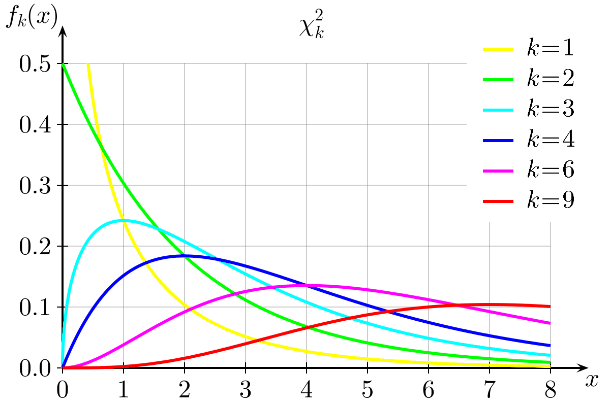

# 运算相关概率

## 随机变量(random variable)
    * 描述
    代表产生随机数的过程，一般用大写字母 如 X 表示
    当看到一个随机变量时，可以把它看成从某个分布函数抽出来的值
    累计分布函数形式化定义
        随机变量X的累计分布函数在某个特定的值 x 上的函数值 被定义为随机变量 X 小于等于 x 的概率
        CDF_x (x) = P(X <= x)
        
    * 1,特征:
        **随机变量是随机实验结果的 可能数值的集合**  
        **可能数值的集合 是它的 样本空间**
        **随机变量通常使用大写字母表示，X 或 Z**
        **随机变量可以是 离散的 或 连续的**
        离散数据只能取某些数值（例如 1、2、3、4、5）
        连续数据可以取一个范围（值域）里的任何数值（例如人的身高）
        
    * 连续随机变量
        均匀分布,正态分布...
    
    * 2,实例:
        随机变量 X = "两个骰子点数的和"
        两个骰子的和 x 有出现以下可能性，列表如下
                一
           1  2  3  4  5  6
        1  2  3  4  5  6  7
        2  3  4  5  6  7  8
    二  3  4  5  6  7  8  9
        4  5  6  7  8  9  10
        5  6  7  8  9  10 11
        6  7  8  9  10 11 12
        总共有 6 × 6 = 36个结果，样本空间 = {2, 3, 4, 5, 6, 7, 8, 9, 10, 11, 12}

        我们数数每个值出现的次数，然后计算其概率：
        2 只出现一次，所以 P(X = 2) = 1/36
        3 出现两次，所以 P(X = 3) = 2/36 = 1/18
        4 出现三次，所以 P(X = 4) = 3/36 = 1/12
        5 出现四次，所以 P(X = 5) = 4/36 = 1/9
        6 出现五次，所以 P(X = 6) = 5/36
        7 出现六次，所以 P(X = 7) = 6/36 = 1/6
        8 出现五次，所以 P(X = 8) = 5/36
        9 出现四次，所以 P(X = 9) = 4/36 = 1/9
        10 出现三次，所以 P(X = 10) = 3/36 = 1/12
        11 出现两次，所以 P(X = 11) = 2/36 = 1/18
        12 出现一次，所以 P(X = 12) = 1/36
    * 求范围值
        一个范围内的值，我们也可以计算随机变量取一个范围内的值的概率
        两个骰子的和为 P(5<= X <=8) 是多少
        P(5<= X <=8) = P(X=5) + P(X=6) + P(X=7) +P(X=8)
            =(4+5+6+5)/36 = 5/9
    * 解随机变量方程
        P(X=x)=1/12 x的值为多少？
        P(X=4) = 1/12, P(X=10) = 1/12
        所以 x=4 | x=10

## 假设检验(statistical_hypothesis_test)
    * 1, 原理,基于反证法逻辑:
        为了证明数学命题A是正确的，我们先假设A是错的，基于假设得出了矛盾结果，我们证明了A是正确的
        
    观察一组随机变量的模型进行检验的科学假说，一旦能估计未知参数，就会希望根据结果 对未知的真正参数作出推论。
    统计上，对参数对假设就是对一个或多个参数对论述
    * 2, 相关术语
    显著性:(significant)
        一个效应在统计学上是显著的, 是指这种效应在一次试验中不太可能(unlikely)发生
        
    零假设 或 原假设:(null hypothesis) 
        
        欲检验其正确性，由研究者决定，反应研究者对未知参数对看法
        基于一种假设的系统模型，在这种假设下我们认为观测到的效应是由偶然因素造成的。
        
    p 值(p-value)
        在原假设下，出现直观效应的概率
        有时候我们为了检验某个直观效应是否真实存在，先假设这个效应不是真实存在，即偶然造成的(原假设)
        然后基于这个原假设计算发生这种效应的概率(P值)，
        
        如果P值非常小，我们就可以认为原假设不大可能是真的
        
    * p 值的求取过程
        * 步骤1 提出原假设:
        有一个样本，按新生儿周数，分为第一胎样本A(4500个数据)，非第一胎样本B(4600个数据)
        原假设:
            总样本数据是独立的
            样本A 和 样本B 怀胎周期 没有差别
        * 步骤2 计算观测值  和 设定阈值   
        样本A和B的 均值差值 sigma = 0.078 周， 
            sigma = 0.078就是 观察到的差值
        假设 阈值 x = - sigma 和 x = sigma
        * 步骤3 计算p值
            重抽样(resampling),有放回的取样  random.choice, # 不是无放回的取样 random.random
            3.1 从总样本中 有放回的抽样 1000次，随机将总样本分成两组，数量等于 样本A 和 样本B
            3.2 求得随机分组的样本A，B之间的 均值的差值 sigma1,sigma2,....sigma1000
            3.3 与观测差值比对,如果求得的这些 1000个差值 sigma_n 中有 125 个 大于等于观测的差值 sigma 0.078 ，
            3.4 那么这里的 p 值 就等于 125/1000 = 0.125, 即 12.5% , 约等于 13%
            3.5 结论，在原假设下, 有13% 的概率出现这种效应(怀胎周期没有差距的效应)，在一次试验中，不大可能出现
                即 关于怀胎周期 第一胎和第二胎是有差距的
       
        
    * 解释(interpretation)
        基于P 值的大小，推断观测到的效应是否具有统计显著性
        如果p值非常小，那么就可以推断，原假设不大可能是真的
    
    
    对立假设(alternative hypothesis)
        通常反应运行鉴定的研究者对参数可能数值对另一种(对立的)看法 ---- 这个才是研究者最想看到的
    
    * 3, 检验步骤:
        1, 提出相关 零假设 和 备择假设  (重要的一步，错误的陈述导致过程混乱)
            原假设(效应不存在) 为 H0
            p 值 p(E|H0)   
            E 是指表观效应符合，或比表观效应更显著的效应
            将p值 与 阈值 alpha做对比
            
        2, 考虑检验中对样本做出的统计假设，如果假设无效，试验的结果也是无效的，假设内容包括:
            关于数据独立性的假设
            关于观测数据分布的假设
        3, 决定哪个检测是合适的，并确定相关统计量 T
        4, 选择一个显著性水平 (alpha， 一般是 5% 或 1%)，低于这个阈值，拒绝零假设
        5, 在零假设成立时，检验统计量T分布，找到数值最接近 备择假设，且几率为显著水平(alpha)的区域，此区域为 拒绝域，意思是零假设成立前提下，落在拒绝域的概率只有 alpha
        6, 针对检验统计量T，根据样本计算其估值  t_obs, 
            若估计值 t_obs 未落在拒绝域，接受零假设
            若估计值 t_obs 落在拒绝域, 拒绝零假设，接受 备择假设
        
    * 4, 例子:
        品茶问题，有一淑女声称可以判断奶茶中先加入茶还是牛奶，现在有 8 杯奶茶，四杯先加牛奶，四杯先加奶茶，随机排列。
        淑女需要说出哪些先加牛奶，哪些先加奶茶，
        检验统计量 是 确认正确的次数
        零假设  是淑女无法判断先加的哪个
        备择假设 是 淑女有 此能力判断
        
        单纯以几率考虑(淑女无法判断先加哪个-->即满足零假设)，八杯都正确的几率 1/70， 概率约 1.4%
        因此 拒绝域 为 8杯结果都正确。
        测试结果为淑女八杯 结果都正确。
        这个例子在统计上是 显著性的(significant)
        
    * 5, 常用检验种类包括:
        t 检验
        Z 检验
        卡方检验
        
        F 检验
        
        均值检验
            比较两组数据的均值的绝对值 是否存在差异 --- 双边检验，两个分布的平均值有显著差异，不关注大小
            单边检验 p值为双边检验的一半，比如只关注 第一胎的数据是否显著高于非 第一胎，更有特异性
        交叉检验(cross validation)
            将数据集分成两份
            一份做训练集(traing set)， 用来计算均值的差别 sigma
            一份做测试集(test set)， 用来计算 P(H_a|E)

    
### 阈值(cutoff) -- 或称 显著性准则(significance criterion)的选择问题, 一般为 5%   --- 习惯性设定的阈值
    假设检验的两个常见问题
        I 类错误(type I error) 又称假阳性(false positive)
            接受类本质为假的假设，认为某个效应具有统计显著性，但实际上该效应是由偶然因素产生的
        
        II 类错误(type II error) 又称假阴性(false negative)
            推翻类本质为真的假设，将某个真实存在的效应归结为 随机事件产生的
    
    * 避免方式
        避免 I 类错误，降低阈值为 1%，那么出现假阳性的概率 也是 1%
        降低阈值时更可能 带来 II 类错误，即 真实存在效应的接受标准提高了，我们更有可能 推翻原假设
        
        同时避免两个错误的方法是 增加有效样本数量或降低测量误差。
        
## 统计解释
    * 古典解释
        p值低于阈值，是统计学显著的
    * 实际解释
        p值越低，人们越相信结论的正确性
    * bayes 贝叶斯解释
        H_0 为原假设，即效应不存在
        H_a 是 H0 的相对假设，即备择假设，即效应真实存在
        P(H_a | E) = (P(E|H_a) * P(H_a)) / P(E)
        
        P(H_a) 为观测到这个效应之前的先验概率
        P(E|H_a) 是 条件概率，即 H_a成立的条件下，观测到 E的概率
        P(E)为任何情况下观测到E的概率
        效应要么存在，要么不存在
        所以有
        P(E) = P(E|H_a) * P(H_a) + P(E|H_0) * P(H_0)

            
## 卡方检验(chi-square test)
    在数据集中有时候均值 差异并不明显，
    卡方检验是用途很广的一种假设检验方法，它在分类资料统计推断中的应用，包括：两个率或两个构成比比较的卡方检验；多个率或多个构成比比较的卡方检验以及分类资料的相关分析等
    应用条件:
    四格表:

        1).随机样本数据；

        2).卡方检验的理论频数不能太小。

    两个独立样本比较可以分以下3种情况：

        1.所有的理论数T≥5并且总样本量n≥40，用Pearson卡方进行检验。

        2.如果理论数T＜5但T≥1，并且n≥40，用连续性校正的卡方进行检验。

        3.如果有理论数T＜1或n＜40，则用Fisher’s检验。

         R×C表卡方检验应用条件：

            1.R×C表中理论数小于5的格子不能超过1/5；

            2.不能有小于1的理论数。我的实验中也不符合R×C表的卡方检验。可以通过增加样本数、列合并来实现。

 
    我们可以检验方差，但是方差相对均值而言，鲁棒性较差，针对方差的统计校验鲁棒性一般较差
    公式:X**2 = 𝜮(i) ((O_i - E_i) **2) /E_i
    O_i 为观测到的值，E_i为预期值
    步骤:
    
        1，把统计的怀孕数据按怀孕周期分为以下几组，计算期望数值
            全部9148个数据      提前出生(<=37)   准时出生(38~40)    延后出生(>=41)
                                p 个提前出生     p个准时出生        p个延后出生    # 期望数据
                                
        2，计算每个分组单元格的 观测值  ？？？(这里应该是期望值吗？)
            
            第一胎4413个数据    提前出生(<=37)   准时出生(38~40)    延后出生(>=41)
                                np 个提前出生     np个准时出生        np个延后出生  # 第一胎观测数值
            非第一胎4735个数据   提前出生(<=37)   准时出生(38~40)    延后出生(>=41)
                                np 个提前出生     np个准时出生        np个延后出生  # 非第一胎观测数值
         3，计算观测数值(O) 到期望数值(E) 的离差 O_i - E_i
         4, 计算某种形式的离差和              
            
            衡量观测到的效应于原假设下期望的结果之间的偏差 的统计量
            比如卡方统计量 
                X**2 = 𝜮(i) ((O_i - E_i) **2) /E_i
    
         5, 利用蒙特卡罗模拟来计算 p 值
            这一步的 p 值表示在原假设下出现比观测值(第4步 计算得到的统计量的值)更大的 卡方统计量的 概率
            
         因为卡方统计量 服从卡方分布，我们可以直接计算出统计检验的 p 值
         在这里假设 卡方统计量 X**2 = 91.6 , p = 0.0001, 我们认为这是 统计显著的，即 首胎 倾向于更早或更晚出生，而较少准时出生
    
    更一般的步骤:
        1,确定用于统计推断的合适统计量;
        2,寻求统计量的精确分布; 在统计量的精确分布难以求出的情形,可考虑利用中心极限定理或其它极限定理找出统计量的极限分布.
        3,基于该统计量的精确分布或极限分布, 求出统计推断问题的精确解或近似解.
        4,根据统计推断结果对问题作出解释
    
    卡方统计示例
   

## 高效再抽样 Efficient sampling
    普通方法: 1, 数据混合在一起，2，按原每组个数重新分组，3，计算两个分组均值差异，4，重复过程，构建分布
    假设数据服从一个分布，均值 mu， 方差 sigma**2， 从这个分布随机抽取n个样本，根据中心极限定理，样本的和渐进服从 N(n*mu, n*sigma**2)
    为了得到样本均值的分布，需要用到正态分布性质：若X服从正态分布 N(mu, sigma**2) 那么 a*X ~ N(a*mu + b, a**2sigma**2)
    设a=1/n， b=0,等式两边同除以n则 X/n ～ N(mu/n , sigma**2/n**2)
    样本均值渐进服从 N(mu, (sigma**2)/n)
    product(∏) 这个符号表示乘积，
    数学中的乘积定义为两个或多个变量相乘的等式的答案。换句话说， product(∏) 是任何乘法问题的答案。

    可以通过将不同变量相乘来找到 product(∏) 。问题中的变量数量可能会发生变化，但大多数情况下，两个数字会相乘以形成 product(∏) 。

    乘法的反面是除法。两个相互分开的变量的答案称为商。在除法中，一个问题中只能存在两个变量，而许多变量可以存在于乘法中。
    
