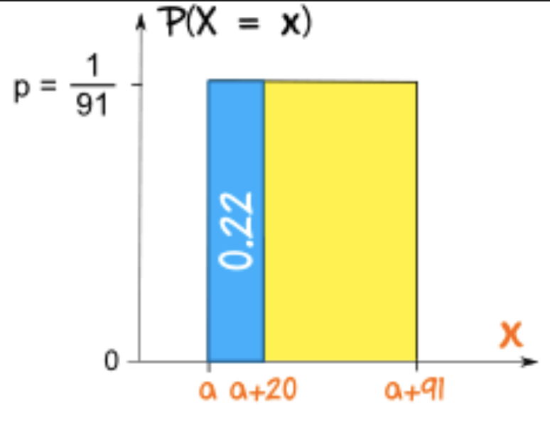
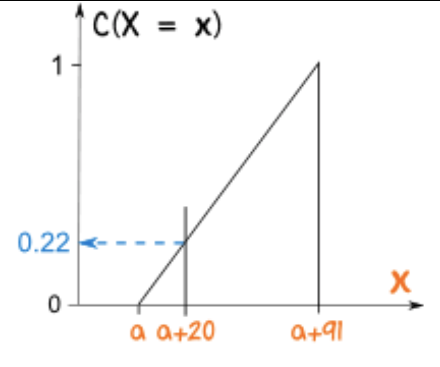
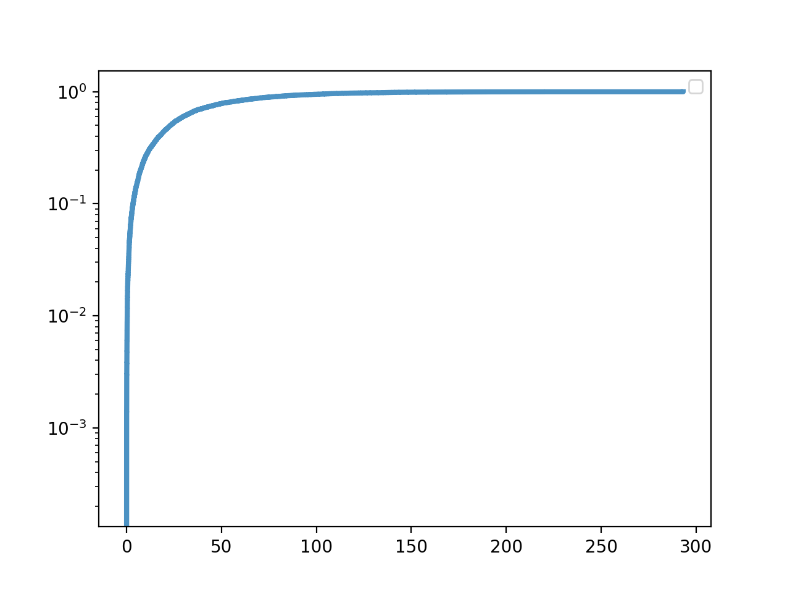
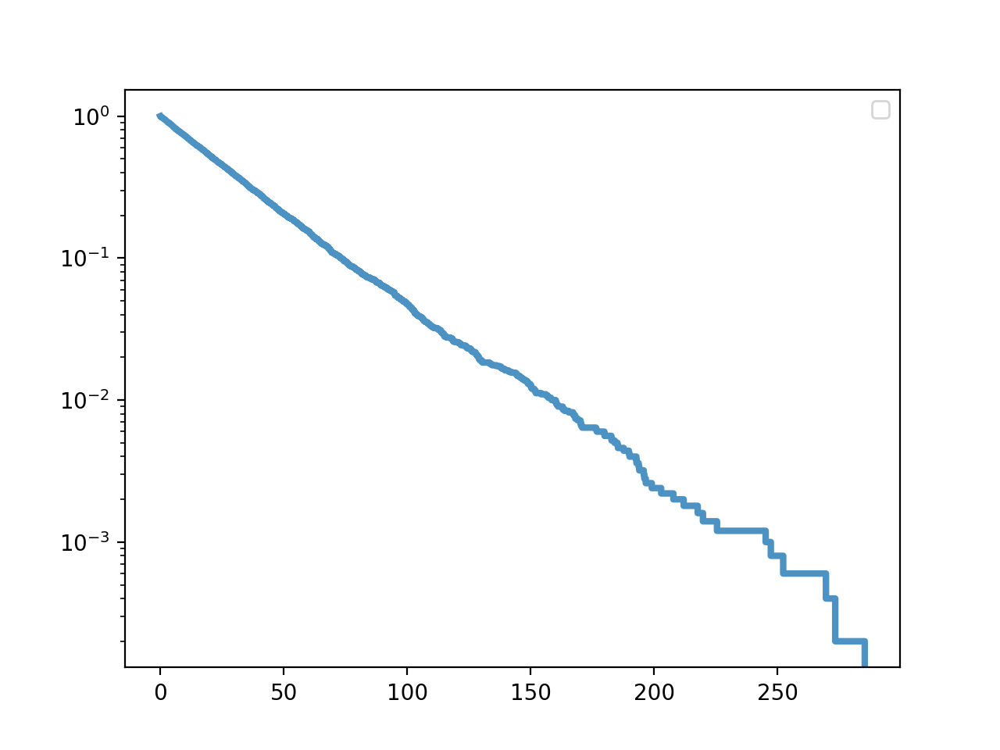
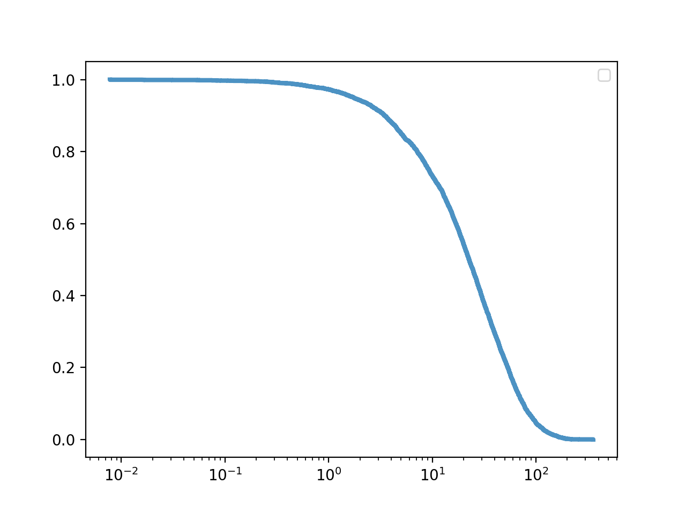
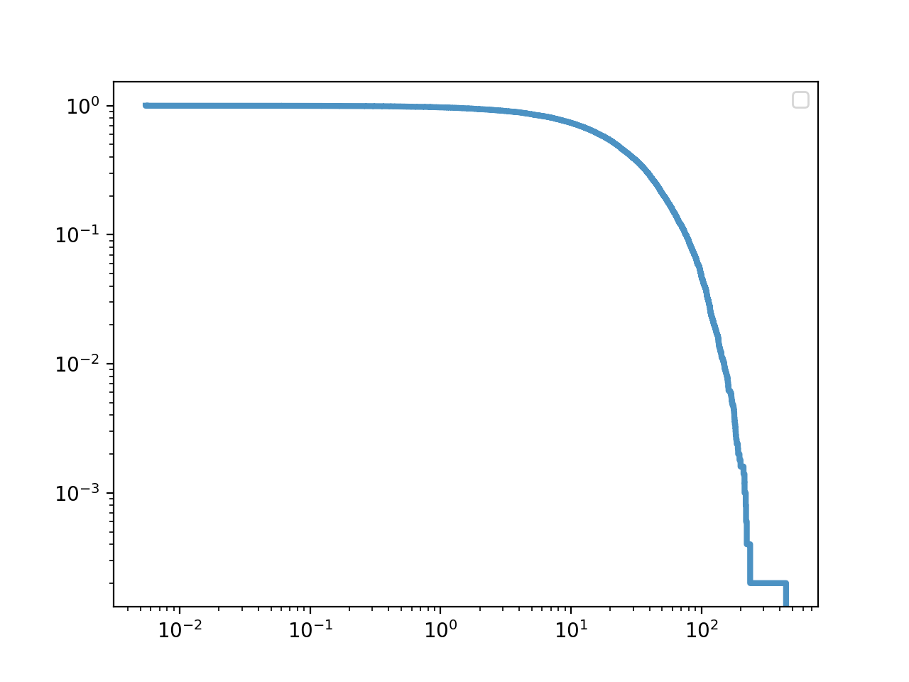
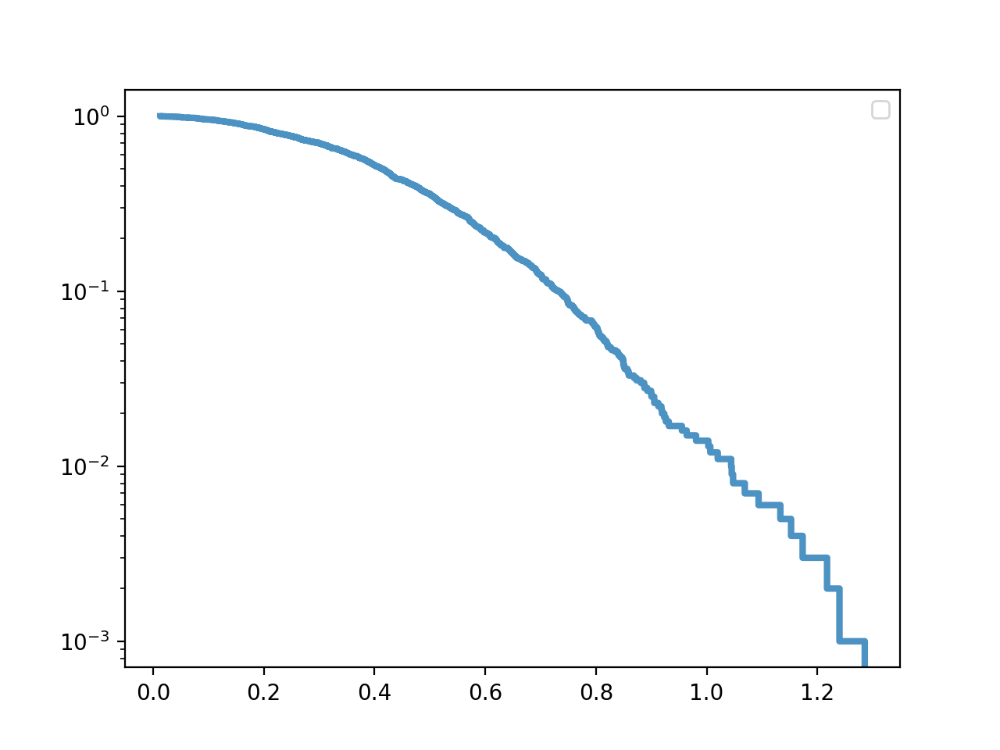
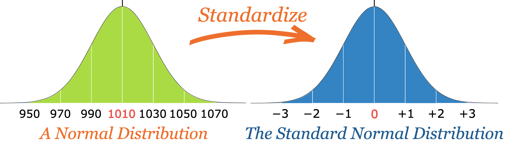
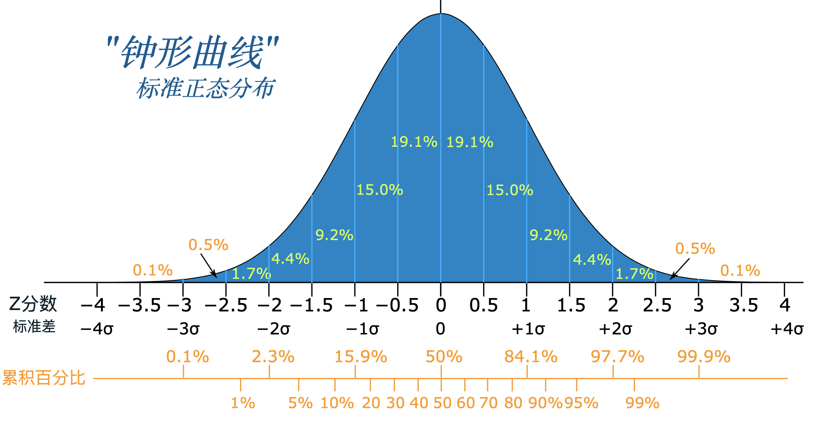
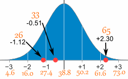

## 连续分布 (continuous distribution)
    可以用于数学分析，如下面将介绍的指数分布
## 累计分布函数(cumulative distribution function CDF)
    可以是连续的分布 或 经验分布 如CDF是 跃阶函数
    * CDF本质是 值到概率等级到映射
        概率从 0开始，逐渐增加到 1
        均匀分布的累计分布函数是一条 斜率为1的直线
    * CDF两个重要方法
        给定值x，计算值所属概率等级p
            p = CDF(x)
        给定概率p，计算响应到值x
            p = CDF(x) 的逆运算 
    均匀分布,也称矩形分布，在这里a，b之间所有随机变量的概率是相等的  
    
    例如: 某个喷泉每隔91分钟触发一次，你在哪里等了22分钟，你有多大可能性看到喷发 
     0.22 的可能性你会看到老忠实喷发。
    如果你等 91分钟内你便一定会（p=1）看到它喷发。
    但你是随机到达哪里的，所以你可能马上看到喷发，或者在 91分钟里的任何时间看到
    
    
   
   
    均匀分布累计分布函数，一条斜率为1的直线
   
    
#### 条件分布
    根据某个条件    
#### 指数分布(exponential distribution) 定义和各种变形
    * 1, 描述:
    观察事件的间隔时间(interarrival time)
    若事件在每个时间点发生概率相同，那么间隔时间的分布就近似于指数分布   
    
    参数 𝝀 决定了分布的形状  
    * 2, 均值和方差
    指数分布的均值就是 1/𝝀 lambda， lambda 𝝀 = 2 时，  1/lambda， lambda/2
        均值就是  0.5
        中位数是  log(2) / 𝝀 lambda
        大概等于  0.35
    方差:
        D(X) = 1 / lambda **2
        X 的偏离系数是： V[X] = 1
    
    * 3, 指数分布的累计分布函数
        CDF(x) = 1 - e**(-𝝀x)  
    lambd = 1 / mean   # mean 为均值，𝝀 即lambd
    random.expovariate(lambd=lambd)   # 函数调用生成一个服从指数分布的值   
    
    指数分布 mean = 34, lambda = 0.0307，按x轴铺开的形状
     
   
    指数分布   
   
   
    指数分布 y 取对数log  
   
   
     指数分布 xy 取对数log  
   
   
     指数分布 cdf 累计分布函数互补函数 ccdf 
   
    
     指数分布 cdf 累计分布函数互补函数 ccdf ylog
   
   
     指数分布 cdf 累计分布函数互补函数 ccdf xlog
   
   
     指数分布 cdf 累计分布函数互补函数 ccdf xylog
   
   
     
    
#### 互补累计分布函数(Complementary CDF, CCDF)
    1 - CDF(x)
    如果数据 CDF 服从指数分布，互补累计分布函数CCDF 应该是一条直线，为什么？
    证明步骤：
        指数分布数据集  y = e**(-𝝀x)
        两边取对数:  log y =  -𝝀x
        这y轴上的值取对数后，CCDF 是一条斜率为  -𝝀 的直线
        如果是完整直线，那么就是说，这各个时间点发生某事件的概率一样
        比如假设的 新生儿在一天各个时间出生概率一样，实际结果CCDF并不是一个直线，所以假设并不成立

#### 帕累托分布(pareto distribution)
    * 1, 描述
    它可以用于模拟情况不均匀分布的任何一般情况，比如 2&8 规律
    最初主要用于研究 财富分布情况,
    后来也用于描述 城镇大小，沙砾，陨石，森林火灾，地震等
    正反馈生成过程的结果，也称偏好依附(preferential attachment)
    帕累托分布由形状参数α（也称为斜率参数或帕累托指数）和位置参数X定义。
    它有两个主要应用：

    模拟收入分配。
        F(x) = 1 – (k(λ**k)/(x**k+1))α
        当用于模拟收入分配时，该公式的特定版本将λ作为最小收入，k作为收入分配。
    模拟城市人口的分布。
    也用于模拟具有特定保修期的制造物品的寿命。

    * 2, 帕累托分布 
        CDF(x) = 1 - (x/x_m) ** (-𝜶) 
    位置参数 x_m(最低值) 和 形状参数𝜶 决定位置和形状
    
    * 3, 性质
    x_m = 0.5, 𝜶 = 1时，
        中位数: x_m * (2 ** (1/𝜶))  = 1
        百分等级 95 的值是 10， 中位数为1的指数分布中，百分等级为 95 的值仅仅是 1.5
        
        "生存函数"又称 尾函数，可靠函数，值大于X的概率
        
    * 4, 形状
    a=1, x=100, 1000000 个值的pareto分布
    pare_n = random.paretovariate(alpha=a)
    pare_n * x    
    
    
    
    pareto distribution log x y  
  
     
  
  
    判断一个分布是否 帕累托 分布： 两条数轴都取对数后，其CCDF 应该基本上是一条直线，如果直线画出服从帕累托分布的样本CCDF，
        函数 y ~= （x/x_m) ** (-𝜶)
        在对y 和 x 取 对数后 logy ~= -𝜶(logx - logx_m)
        以上应该基本上是条直线，
        斜率 -𝜶 ，
        截距 -𝜶logx_m  ,当x为0时，y的取值
            在坐标几何里，一个函数或关系式与直角坐标系的 y-轴相交的点的 y-坐标，称为 y-截距，也可借此测量斜率。
            假若，一个函数的形式为 y=f(x)\,\! 。那么， f(0)\,\! 就是这函数的 y-截距
    pareto CCDF互补函数如下
    
    
    pareto 互补函数y值取对数log
    
  
    Pareto 互补函数x，y取对数log
  
    
    
    应用一：Zipf法则
        任何语料库，计算每个词对出现次数，每个单词出现次数的 分布， 近似于 帕累托分布
        单词出现次数的CCDF
    
#### 威布尔分布
    源自故障分析，广义的指数分布
    
    weibull = random.weibullvariate(alpha=a, beta=b)
    weibull     
    
    
    
    weibull distribution log x y  
  
      
  
    weibull 互补函数如下
    
    
    weibull 互补函数y值取对数log
    
  
    weibull 互补函数x，y取对数log
  
    
    
    
#### 模糊概念
    对称，中心，离群值，线性
    计划，执行，检查，行动
    
#### 正态分布, 高斯分布
    最重要的连续分布
    正态分布的随机变量有个独特的名字 Z，Z的分布是钟形曲线，下面会讲到。 
    一，相关概念:
        1, 参数 𝝁 (mu) 和 𝝈 (sigma) 决定了分布的均值和标准差
        2, 标准分的别名: 与平均值的标准偏差的数量也称为“标准分数”，“西格玛”或“z分数” z score
        
        3, 标准分的计算:
              z 是 "Z分数"（标准分数）
              x 是要标准化的数值
              μ 是平均
              σ 是标准差
        
        4, 误差函数(error functoin) 表示各等级频数分布
                
        模型与误差之间的区别
        模型：一种对数据对有效简化
        erf(x)
        CDF(x) = 1/2 * [1 + erf( (x-𝝁)/𝝈*√2)]
        erf(x) = 2/√𝝅 ∫(0,x) e ** (-r**2) dt
    
    
    二，正态分布概率图(normal probability plot)
        作用：用于判断正太分布是否可用于某份数据的建模
        算法：基于正太分布 秩变换(rankit)，即对 n 个服从正太分布对值排序，第 k 个值分布的均值就称为第 k 个秩变换
    
    三，* 正态分布的性质:
        0, 正态分布：

            平均值 = 中位数 = 众数
            沿中线对称,50% 的值小于平均值,50% 的值大于平均值

        1, 正态分布对线性变换 和 卷积运算是封闭的(closed)
            一个随机变量X 服从 𝝁 和 𝝈 的正态分布，我们可以简记为:
            X ~ 𝜨(𝝁, 𝝈 )
        另有一个 随机变量X的线性变换 表达式: X' = aX + b
        这里a 和 b为实数，X' 和 X 属于同一分布族时，我们说该分布族对线性变换是 封闭的(closed)
        比如 正态分布 X ~ 𝜨(𝝁, 𝝈**2),
        那么  X' ~ N(a𝝁+b, 𝝈a**2 )
        
        2，正态分布对卷积运算是封闭的(closed)
            Z = X+Y
            X ~ 𝜨(𝝁_x, (𝝈_x)**2)
            Y ~ 𝜨(𝝁_y, (𝝈_y)**2)
            那么
            Z ～ (𝝁_x + 𝝁_y, (𝝈_x)**2 + (𝝈_y)**2)
            
     四，* 正态分布的钟形曲线，
        当我们计算标准偏差时，我们通常会发现：
        68％的值在平均值的1个标准差
        95％的值都在2个标准差的平均值。
        99.7%的值都在3个标准差的平均值
        剩下的0.3%％ 是平均值两侧的第4个标准差（总共4个标准偏差）
        可以这样描述分布:
            可能在1个标准差内（应该是100个中的68个）
            非常可能在2个标准偏差范围内（100个应该是95个）
            几乎可以肯定在3个标准偏差内（1000个应该是997个）
     * 我们可以采用任何正态分布并将其转换为标准正态分布
    五，* 实例
        5.1， 正态分布的标准化过程: (正态分布 ---> 标准正态分布)   
            先减去均值，
            然后除以标准偏差
            这样做被称为“标准化”：
            
       
   
   
        5.2，标准化后我们可以为数据做决定， 比如老师在批改一个很难的测验，满分100
        [33.4,  25.05, 43.42, 53.44, 30.53, 58.45, 23.38, 43.42, 36.74, 28.39]
        以上学生分数，一个60及格都没有，我们来标准化所有分数，把合格分定在平均 以下一个标准差
        平均值: mean = 37.62  
        标准差:sigma = 11.25
        低于平均值一个标准差的 37.62 - 11.25 = 26.37, 
            只有 25.05 和 23.38 两个同学
         
        5.3，如下图，最近测验成绩符合正态分布，你的分数高出平均值 1个标准差，有几个人比你分数低？
            0~1 个标准差之间是 19.1 + 15.0 = 34.1%
            < 0 是 50%
            所以理论上你比 84.1% 的人分数都高
            换言之 理论上 84.1% 的分数比你低（实际上百分比可能不同）
   
   
   
   
        5.4，* 实例:
        每日旅行时间调查得出以下结果（以分钟为单位）：
        26, 33, 65, 28, 34, 55, 25, 44, 50, 36, 26, 37, 43, 62, 35, 38, 45, 32, 28, 34
        平均值为38.8分钟，标准偏差为11.4分钟（如果需要，可以将值复制并粘贴到标准偏差计算器中）。

        将值转换为z分数（“标准分数”）。
        第一个数字的处理:
            步骤1:  26 - 38.8 = -12.8    # 减去平均值
            步骤2:  -12.8 / 11.4 = -1.12 # 除以标准偏差
            
            Original Value(原始数据)	Calculation(计算过程)  	Standard Score(z-score)(标准分)
                        26	         (26-38.8) / 11.4   =	-1.12
                        33	         (33-38.8) / 11.4   =	-0.51
                        65	         (65-38.8) / 11.4   =	+2.30
                        ...
                        
   
     
     
     六，* 模型形状:
        
        
        如何判断一份数据集是否适合高斯分布建模。
        通过一些简单转换如 对数转换可以判断是否适合指数分布，pareto distribution， 威布尔分布。
        正态模型需要通过秩转换(rankit)来判断，通过对多个服从正态分布的值排序，第k值分布的均值，就是第k个秩变换。
        模拟步骤如下:
        1， 以 mu=0 和 sigma=1的正态分布中生成一个跟你数据集一样大小的样本。     
        2， 对数据集中的值进行排序。     
        3， 画出排序后的值和第一步生成的值的散点图。     
      
    normal distribution    
   
   
     normal distribution cdf 正态分布的累计分布函数没有明确的方法，
     这里用的erf-(error function)函数(误差函数表示)，正态分布的cdf 是 s型曲线
   
   
     normal distribution cdf ylog  
   
   
     normal distri cdf xlog
   
   
     normal distri ccdf
   
     
     normal distri ccdf xylog
   
   
     normal distri ccdf xlog
   
  
#### 标准正态分布表
    下表，精确度两位数，"0.1" 的值垂直排列，然后把每个 0.1 后面的 "0.01" 值水平排列
    如 P(0<= Z <=0.51) = 0.1950
    
    Z	0.00	0.01	0.02	0.03	0.04	0.05	0.06	0.07	0.08	0.09
    0.0	0.0000	0.0040	0.0080	0.0120	0.0160	0.0199	0.0239	0.0279	0.0319	0.0359
    0.1	0.0398	0.0438	0.0478	0.0517	0.0557	0.0596	0.0636	0.0675	0.0714	0.0753
    0.2	0.0793	0.0832	0.0871	0.0910	0.0948	0.0987	0.1026	0.1064	0.1103	0.1141
    0.3	0.1179	0.1217	0.1255	0.1293	0.1331	0.1368	0.1406	0.1443	0.1480	0.1517
    0.4	0.1554	0.1591	0.1628	0.1664	0.1700	0.1736	0.1772	0.1808	0.1844	0.1879
    0.5	0.1915	0.1950	0.1985	0.2019	0.2054	0.2088	0.2123	0.2157	0.2190	0.2224
    0.6	0.2257	0.2291	0.2324	0.2357	0.2389	0.2422	0.2454	0.2486	0.2517	0.2549
    0.7	0.2580	0.2611	0.2642	0.2673	0.2704	0.2734	0.2764	0.2794	0.2823	0.2852
    0.8	0.2881	0.2910	0.2939	0.2967	0.2995	0.3023	0.3051	0.3078	0.3106	0.3133
    0.9	0.3159	0.3186	0.3212	0.3238	0.3264	0.3289	0.3315	0.3340	0.3365	0.3389
    1.0	0.3413	0.3438	0.3461	0.3485	0.3508	0.3531	0.3554	0.3577	0.3599	0.3621
    1.1	0.3643	0.3665	0.3686	0.3708	0.3729	0.3749	0.3770	0.3790	0.3810	0.3830
    1.2	0.3849	0.3869	0.3888	0.3907	0.3925	0.3944	0.3962	0.3980	0.3997	0.4015
    1.3	0.4032	0.4049	0.4066	0.4082	0.4099	0.4115	0.4131	0.4147	0.4162	0.4177
    1.4	0.4192	0.4207	0.4222	0.4236	0.4251	0.4265	0.4279	0.4292	0.4306	0.4319
    1.5	0.4332	0.4345	0.4357	0.4370	0.4382	0.4394	0.4406	0.4418	0.4429	0.4441
    1.6	0.4452	0.4463	0.4474	0.4484	0.4495	0.4505	0.4515	0.4525	0.4535	0.4545
    1.7	0.4554	0.4564	0.4573	0.4582	0.4591	0.4599	0.4608	0.4616	0.4625	0.4633
    1.8	0.4641	0.4649	0.4656	0.4664	0.4671	0.4678	0.4686	0.4693	0.4699	0.4706
    1.9	0.4713	0.4719	0.4726	0.4732	0.4738	0.4744	0.4750	0.4756	0.4761	0.4767
    2.0	0.4772	0.4778	0.4783	0.4788	0.4793	0.4798	0.4803	0.4808	0.4812	0.4817
    2.1	0.4821	0.4826	0.4830	0.4834	0.4838	0.4842	0.4846	0.4850	0.4854	0.4857
    2.2	0.4861	0.4864	0.4868	0.4871	0.4875	0.4878	0.4881	0.4884	0.4887	0.4890
    2.3	0.4893	0.4896	0.4898	0.4901	0.4904	0.4906	0.4909	0.4911	0.4913	0.4916
    2.4	0.4918	0.4920	0.4922	0.4925	0.4927	0.4929	0.4931	0.4932	0.4934	0.4936
    2.5	0.4938	0.4940	0.4941	0.4943	0.4945	0.4946	0.4948	0.4949	0.4951	0.4952
    2.6	0.4953	0.4955	0.4956	0.4957	0.4959	0.4960	0.4961	0.4962	0.4963	0.4964
    2.7	0.4965	0.4966	0.4967	0.4968	0.4969	0.4970	0.4971	0.4972	0.4973	0.4974
    2.8	0.4974	0.4975	0.4976	0.4977	0.4977	0.4978	0.4979	0.4979	0.4980	0.4981
    2.9	0.4981	0.4982	0.4982	0.4983	0.4984	0.4984	0.4985	0.4985	0.4986	0.4986
    3.0	0.4987	0.4987	0.4987	0.4988	0.4988	0.4989	0.4989	0.4989	0.4990	0.4990
        

#### 对数正态分布(lognormal distribution)
    一组数据经过对数转换后，服从正态分布，这组数据服从 对数正态分布，对数正态分布的CDF 与正态分布一样，这里x为 logx
        CDF_lognormal(x) = CDF_normal(log_x)
    正态分布的参数一般是 mu 和 sigma，  在对数正态分布中，mu 和 sigma 不表示 均值和标准差
    在对数正态分布中
        均值为: exp(mu + (sigma**2)/2 )   # 自然数 e 的(mu + (sigma**2)/2 ) 次方
        标准差为: D(X) = (exp(sigma**2) - 1) * (exp(2*mu + sigma**2)) 
        
     性质:
        (1)正态分布经指数变换后即为对数正态分布；对数正态分布经对数变换后即为正态分布。
        (2)γ，t是正实数，X是参数为(μ，σ)的对数正态分布，则  仍是对数正态分布，参数为。
        (3)对数正态总是右偏的。
        (4)对数正态分布的均值和方差是其参数(μ，σ)的增函数。
        (5)对给定的参数μ，当σ趋于零时，对数正态分布的均值趋于exp(μ)，方差趋于零。
     
     图形:
     
        log normal dis 累计分布函数 cdf
        
   
 
        log normal dis 概率密度函数 pdf
        
   
 
 
#### 正态概率图
    当我们想知道我们当数据集和模型之间有多大差距时，可以使用概率图的方式。
    在对数尺度上，CCDF的尾部看起来像一条直线，即表示帕雷托分布，但事实证明这是误导性的。
    在对数-x尺度上，分布具有对数正态分布的特征 sigmoid。
    日志（大小）的正态概率图(normal probability plot)确认数据与对数法线模型(lognormal models)非常拟合。
    使用 Pareto 模型描述的许多现象也可以使用对数法线模型来描述，或者更好。
    
     正态概率图可以表示数据集与模型之间的匹配图，图中线的曲度越大，匹配度越 小
   
    
#### 使用模型的好处
    1， 用较少的参数 模拟 大量的数据集
    2， 观察自然现象中的 分布情况，可以让我们深入理解真实系统
    3， 有时候我们可以解释数据 服从某个分布的 特定形式的原因。
    4， 连续分布 可以用于数学分析